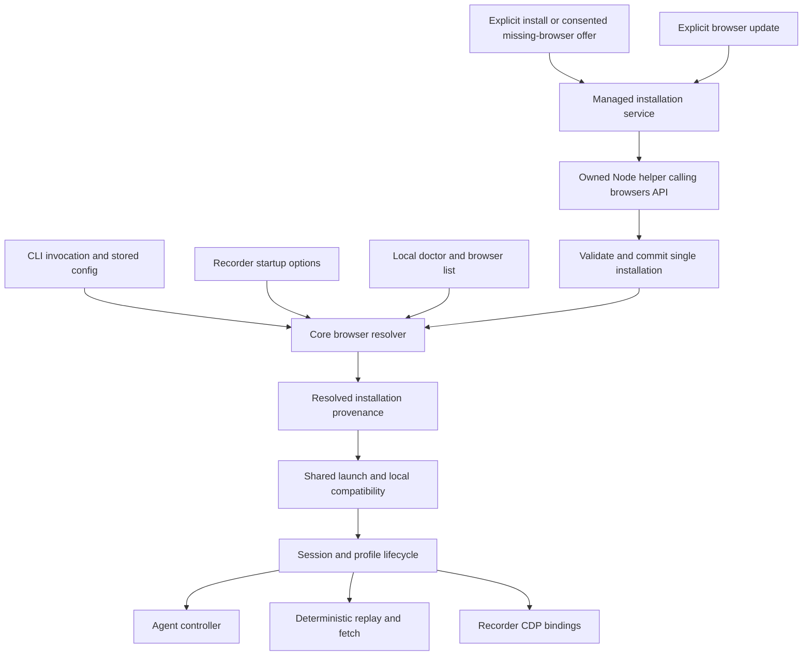

<!-- Generated by spec-lite | agent: spec.planner | date: 2026-09-11 -->

# Plan: Puppeteer migration and Yantra-managed Chrome

## 1. Overview

Upgrade every repository use of `puppeteer-core` to 25.10.0 and provide a single Yantra-managed Chrome for Testing Stable installation. Users can install it, select it or their own Chrome/Chromium, inspect the selected browser through doctor, and explicitly update the managed installation. Existing automation, recording, workflow artifacts, profile isolation, and browser-policy behavior remain intact.

This named plan implements the user's approved five-feature breakdown and architecture. It incorporates the later corrections: **updates occur only through `yantra browser update`; `yantra browser update --dry-run` explicitly reports availability without changing an installation, and `yantra browser check` explicitly diagnoses local compatibility. Ordinary sessions, startup, init, list, use, and doctor never check for updates.** There is one logical managed installation, no selectable version history, pinning, or rollback command. This document is the concrete implementation blueprint for review; it authorizes planning/specification work only, not implementation.

The complete discovery evidence is in [puppeteer_usage_audit.md](puppeteer_usage_audit.md). Source findings take precedence over stale historical documentation; `.spec-lite/memory.md` supplies standing standards. The memory and old plan's system-only Chrome choice is superseded for this plan by the user's explicit managed-browser request. Do not rewrite memory or implemented feature-summary state during planning.

### Revision 2026-09-12 — plan-critic corrections applied

[plan_critique_puppeteer_browser_management.md](reviews/plan_critique_puppeteer_browser_management.md) verified this plan's upstream claims against the published `puppeteer-core@25.10.0` and `@puppeteer/browsers@3.2.2` artifacts, live Chrome for Testing metadata, and Node 24.15.0 rather than against documentation. The following corrections are now incorporated throughout and supersede the earlier text:

1. **`clickCount` was not removed** — it survives as `@internal` and is _overwritten_ by `count` at runtime, so the migration is a behavior decision, not a rename (§7.2). The text-selection gesture is now an explicit, carved-out user-simulation change.
2. **`browser update --check` is renamed `browser update --dry-run`** to match the spelling `config data-dir` already owns and to stop colliding with `browser check` (§5).
3. **Upstream `.metadata` never records absolute executable paths for the default provider**, so the repair requirement is deleted (§4, §7.4).
4. **A configured proxy is honored via Node's built-in `NODE_USE_ENV_PROXY`** instead of failing closed (§6).
5. **Missing Linux shared libraries are a first-class, separately classified failure** with remediation rendered from the installation's own `deb.deps` (§7.3).
6. **Transaction phases and crash recovery collapse into orphan collection** — a child cache the ready pointer does not name is an orphan (§7.5).
7. **Extraction descendants are enumerated**, including the previously undocumented Windows `setup.exe` spawn (§7.4), and archive integrity is a recorded decision (§6).
8. **Capability-checked is the steady state, not the exception** — current Stable is 153, the tested pairing is 152 (§7.3, §10).
9. **`yantra config data-dir` relocation is coordinated** with managed binaries and active runs (§4, §7.5).
10. **FEAT-042 delivers in two gated stages** so the dependency bump is validated independently of the behavior refactor (§2, §7.6).

### Confirmed product decisions

- Use the `@puppeteer/browsers` **programmatic API**, not its CLI or an `npx` command.
- Download **Chrome for Testing Stable** for the supported host platform; latest means Stable at explicit install/update time, never the `latest` browser tag.
- With automatic selection, prefer the Yantra-managed installation when present; otherwise discover external Chrome/Chromium.
- An interactive browser task with no selected usable installation offers a clearly explained download. Automation, non-TTY and JSON invocations require explicit installation and never prompt or download implicitly.
- `yantra browser update` checks current Stable, reports the proposed version/path, and asks before replacement on a TTY. Explicit noninteractive acceptance is supported by `--yes`.
- Explicit diagnostics are available: `browser check` reports driver/browser versions and a fresh local compatibility test; `browser update --dry-run` reports current versus available Stable without download, replacement, cleanup or selection mutation.
- Reuse the installed browser offline. No update network traffic, reminders, schedules, or background checking elsewhere.
- A Stable build newer than the Puppeteer-tested pairing may run after required capability checks pass. **This is the normal case, not an exception:** current CfT Stable is `153.0.8010.36` while Puppeteer 25.10.0's tested pairing is `152.0.7977.75`, and Chrome ships Stable faster than this repository will bump Puppeteer. Older external Chrome/Chromium is also allowed only when required checks pass. This is a capability decision, not a universal compatibility guarantee.
- Browser choices are installation state in `config.yaml`; installed binaries live under the resolved Yantra data directory. Explicit broken selections fail with remediation rather than silently choosing something else.
- Replacement refuses while a Yantra-managed browser run is active. There is no multi-version management surface or retention policy.

### Scope boundaries

In scope: all direct/indirect Puppeteer usage; agent/executor/recorder lifecycle; local browser selection, provisioning, compatibility, diagnostics, CLI/JSON UX, documentation, and meaningful cross-platform validation. Existing external Chrome/Chromium discovery remains available. Managed availability follows upstream CfT platform support; an unsupported host receives an actionable error and can use compatible external Chrome/Chromium.

Out of scope: Firefox/WebDriver BiDi migration; remote browser connections; personal Chrome profile adoption; updating/uninstalling external binaries; OS package installation or administrator elevation; background update checks; multiple selectable managed builds, rollback, pinning, install-version/channel arguments; custom download mirrors; new generic settings frameworks; rewriting Yantra's locator/actionability engine into Puppeteer locators.

Existing user-simulation behavior is preserved **with one carved-out exception**: the pre-typing text-selection gesture in the two fill paths. Puppeteer 25 offers no option that reproduces its current event sequence (§7.2), so that gesture necessarily changes and the change is owned here rather than excluded. No other launch argument, pointer, keyboard, timing or stealth behavior changes in this plan.

## 2. High-Level Features

| ID       | Feature                                                                                                                                                  | Spec File                                                 | Status          |
| -------- | -------------------------------------------------------------------------------------------------------------------------------------------------------- | --------------------------------------------------------- | --------------- |
| FEAT-042 | Puppeteer 25.10 migration — **Stage A** exact pin and text-selection gesture; **Stage B** popup/session/frame ownership and handle/listener lifecycle    | `features/FEAT-042-puppeteer_api_migration/spec.md`       | [x] Complete    |
| FEAT-043 | Unified browser resolution and launch — one selection/compatibility contract and reliable lifecycle for provider and recorder                            | `features/FEAT-043-browser_resolution_lifecycle/spec.md`  | [x] Complete    |
| FEAT-044 | Managed Stable installation — explicit install, isolated API operation, interactive missing-browser offer, cancellation and coordination                 | `features/FEAT-044-managed_stable_installation/spec.md`   | [x] Complete    |
| FEAT-045 | Browser switching and diagnostics — persistent/per-invocation choice, explicit compatibility check, local list/doctor, terminal/JSON provenance          | `features/FEAT-045-browser_switching_diagnostics/spec.md` | [ ] Not started |
| FEAT-046 | Explicit managed update — availability-only `--dry-run`, consented single-installation replacement, busy refusal, failure handling and orphan collection | `features/FEAT-046-explicit_managed_update/spec.md`       | [ ] Not started |

IDs 042–046 follow the maximum 041 found across every existing plan's numbered feature rows and modern/legacy feature directories. IDs are immutable. Feature generation fills `Spec File`; only Implement changes statuses.

Implementation order is 042 → 043 → 044 → 045 → 046. Each feature delivers observable behavior with its own tests and documentation; later features extend the same shared contracts rather than introduce a parallel resolver or installer.

**FEAT-042 delivers in two ordered stages with separate acceptance gates.** Only one change in v25 is compile-forced: `clickCount` is absent from the published type rollup. `Page.target()` is merely `@deprecated` and still present, `Browser.target()` is not deprecated at all, `CDPSession.connection()` is public today, and `Frame._id` is already reached through a cast. So the version bump is a three-call-site change while popup events, recorder session correlation and frame tokens are behavior refactors that v25 _enables_ but does not require — each with its own regression surface.

- **Stage A** — exact `puppeteer-core` pin and lockfile, the three `clickCount` call sites, and the text-selection decision in §7.2. Gate: the complete existing regression suite green on v25 across the supported matrix, plus the new replacement-semantics tests. Nothing else changes.
- **Stage B** — popup event ownership, recorder child-session correlation, frame tokens, handle and listener lifecycle. Gate: §7.6's FEAT-042 row.

Staging rather than two feature IDs keeps IDs immutable and preserves the already-written spec file. Stage A must be independently green before Stage B begins, so instability in the refactor is never mistaken for instability in the upgrade. Note that the recorder session-lookup defect (§7.2) is **live on v24** and is not caused by the upgrade.

## 3. Tech Stack Additions

Standing TypeScript, Node, ESM, pnpm, Vitest, Pino and filesystem conventions remain per memory.

| Component                      | Technology                                                             | Justification                                                                                 |
| ------------------------------ | ---------------------------------------------------------------------- | --------------------------------------------------------------------------------------------- |
| Browser driver update          | `puppeteer-core` **25.10.0**, exact direct declaration and lockfile    | Requested migration target; exact pin makes the reviewed major-version behavior reproducible. |
| Managed browser API            | `@puppeteer/browsers` **3.2.2**, exact direct declaration in core      | Version used by Puppeteer 25.10.0; direct import must not depend on transitive availability.  |
| Managed operation coordination | Existing `proper-lockfile`, Node process/IPC and filesystem primitives | No new worker, scheduler, database or locking dependency.                                     |
| Download proxy support         | Node's built-in `NODE_USE_ENV_PROXY` on the owned helper process       | Honors configured proxies for `node:https` with no new dependency; see §6.                    |

Puppeteer 25.10.0 requires Node >=22.12.0; the repository requires Node >=24.15.0, which also supplies the built-in environment-proxy support above. `@puppeteer/browsers@3.2.2` declares only `yargs` and `modern-tar` — notably **not** `proxy-agent`, which its HTTP layer imports optionally and silently skips when absent.

The official tested pairing is CfT `152.0.7977.75`, while current CfT Stable is `153.0.8010.36`. Keep the pairing in one driver-owned compatibility descriptor as a tested baseline — it is not the Stable resolver, not a minimum-major constant, and not an expectation that installed builds will match it. That descriptor also owns the CfT platform mapping and the supported-host decision, so a future Puppeteer bump is one edited record plus a probe-revision increment. [Puppeteer changelog](https://pptr.dev/CHANGELOG), [supported browsers](https://pptr.dev/supported-browsers).

## 4. Data Model (High-Level)

No relational schema or database migration is needed. Do not expand `.spec-lite/data_model.md` for browser downloads.

### Domain concepts

- **Browser selection**: installation binding chosen for a run: automatic, managed, or external system/custom binary. Persisted selection lives only in `config.yaml`; an invocation override is ephemeral.
- **Resolved installation**: validated executable identity, ownership, version, platform and provenance. Discovery is read-only; resolution never downloads.
- **Managed installation**: one ready browser build and its relative executable identity under a Yantra-owned root. Only the ready record makes a managed build selectable.
- **Managed operation**: transient exclusive install/update claim, with the owner and the exact candidate/previous paths it is authorized to write and delete. It is neither version history nor a resumable transaction — an operation that dies leaves an orphan, and orphans are collected, not recovered.
- **Active managed run**: shared use reservation from resolution through actual browser process exit. Mutation requires the absence of active reservations.
- **Compatibility result**: local evidence keyed by browser identity, driver version and probe revision. Records what was checked and why launch was refused or permitted.

### Storage strategy

`browser/paths.ts` remains the sole path-building seam. Add a managed root beneath `dataDir()/browsers`; all binaries, ready state, operation state and coordination paths remain under that root. Every initial install and update candidate gets a dedicated sibling child cache root `installation-<opaque-id>` beneath that managed root. The browsers package's `cacheDir` points to that child, never the managed root itself or the global Puppeteer cache. The single ready record stores the relative child-cache root and relative executable identity. Opaque child names are operation identities, not version history. The coordinator's state remains outside child caches, so deleting an exact previous child cannot encompass a candidate or coordination files. Never recursively delete the managed root.

A renamed/relocated Yantra data directory resolves the executable from validated relative ready state. Recompute the executable path with the public `computeExecutablePath({ browser, buildId, platform, cacheDir })` using the recorded browser/platform/build and the current child cache root; never persist or trust a cached absolute `InstalledBrowser.executablePath`.

There is **no upstream metadata repair requirement**. Verified in `@puppeteer/browsers@3.2.2`: `Cache.writeExecutablePath` is called from exactly one site, guarded by `if (!(provider instanceof DefaultProvider))`, and the values it stores are explicitly relative to the installation directory (`computeExecutablePath` joins them onto `installationDir`). This plan permits only the default official provider, so `.metadata.executablePaths` is never written and no absolute path exists to go stale. Instead of repair logic, add a guard that a non-default provider is never configured — that is the only change that could reintroduce the case — and keep one relocation test asserting recomputation resolves to a real executable.

**Relocation is coordinated, not just recomputed.** `yantra config data-dir` physically moves the data tree (`apps/cli/src/commands/config.ts`), guarded today only by the daemon/run lock, and its rollback is a single `rename` that cannot undo a copy-based cross-volume move. Once managed binaries live under `dataDir()`, that command must consult the same active managed-use reservation and refuse while one is live — on Windows a running managed `chrome.exe` holds its binary open and would fail the move partway, producing exactly the unmanaged half-state this section works to prevent. Relocation must also not silently copy a gigabyte of re-downloadable binaries across volumes: the managed tree is dropped and re-resolved, or moved only when it fits within the same volume. Whichever is chosen, `config data-dir` is a first-class caller of the coordination contract in §7.5, not an unrelated command.

Scratch archives/extraction belong under the managed root as dictated by the browsers API. Do not promise a separate temporary archive option: `install()` does not expose one. Do not stage on potentially relocated `cacheDir()` and then assume a cross-volume rename is atomic. Local compatibility diagnostics may use the ordinary cache root; losing them triggers a new local probe, never an update/download.

One normal ready record represents one usable managed installation. **Any `installation-*` child the ready pointer does not name is an orphan** — that single rule replaces candidate/previous bookkeeping, transaction phases and crash recovery, because the disjoint-child layout plus one atomically published pointer already makes every interrupted state indistinguishable and every correct response identical. A candidate under construction is an orphan that happens to have a live owner; an abandoned candidate and a superseded previous installation are orphans with no owner. None of them are ever choices in list/use.

Explicit `install`/`update` deletes unreserved orphans before proceeding, by exact recorded path under canonical containment. A deletion that fails is logged and retried on the next explicit operation; it never fails the operation that just published a verified installation, and it never reports a successful update while an orphan is still selectable — orphans are unselectable by construction, since selection reads the pointer. Never report a successful completed update while knowingly retaining an unmanaged selectable history. Never recursively delete the managed root, and never delete a common ancestor of old and new installations.

## 5. Interface Design

### User command surface

All commands use the existing command registration, renderer and JSON envelope conventions. No version or channel argument is accepted.

| Command                                                                                                    | Behavior                                                                                                                                                                                                                                                                                                                                                                                                                                                                                                                                                                                                                                          |
| ---------------------------------------------------------------------------------------------------------- | ------------------------------------------------------------------------------------------------------------------------------------------------------------------------------------------------------------------------------------------------------------------------------------------------------------------------------------------------------------------------------------------------------------------------------------------------------------------------------------------------------------------------------------------------------------------------------------------------------------------------------------------------- |
| `yantra browser list [--json]`                                                                             | Local inventory: managed installation if ready, external discovered alternatives, current selection and effective source/path/version. No network, launch, install or update checks. This is a browser list, not a version list.                                                                                                                                                                                                                                                                                                                                                                                                                  |
| `yantra browser install [--yes] [--json]`                                                                  | Explicitly install current CfT Stable if managed Chrome is absent. Explain version, destination and ownership before download. Existing ready managed installation is an idempotent local success directing users to update; do not check Stable or change selection in that case.                                                                                                                                                                                                                                                                                                                                                                |
| `yantra browser use <auto\|managed\|system> [--path <absolute-executable>] [--json]`                       | Validate and persist the installation binding. `--path` is legal only with `system`; it selects a custom external executable. The selected binary must be locally **resolvable** before selection is committed — a missing, unreadable or non-executable path is a validation failure. Compatibility is **not** re-probed here: `use` reuses cached probe evidence when it exists and otherwise commits and reports `compatibility: unverified` with the exact `yantra browser check` command to run. `auto` clears the explicit path; `managed` requires an existing ready installation. Never launch a browser, download, or check for updates. |
| `yantra browser check [--browser <auto\|managed\|system>] [--browser-path <absolute-executable>] [--json]` | Explicit fresh local compatibility check against the selected/overridden executable using isolated synthetic pages and the shared probe. Report Puppeteer version, tested pairing, actual browser version/path/ownership, passed/failed required capabilities, limitations and remediation. Never fetch update metadata or download, change selection, or invoke a model.                                                                                                                                                                                                                                                                         |
| `yantra browser update [--yes] [--json]`                                                                   | The **only update-check surface**. Requires an existing managed installation, resolves current Stable, reports unchanged or proposed replacement, asks on TTY unless --yes, then safely replaces only when idle. Missing installation directs to install. External selection/binaries are untouched.                                                                                                                                                                                                                                                                                                                                              |
| `yantra browser update --dry-run [--json]`                                                                 | Explicit availability-only mode: resolve Stable metadata and compare with the locally recorded managed build. No confirmation/--yes required in JSON/non-TTY; no download, install, replacement, launch, ready/config mutation, or orphan collection. If managed Chrome is absent, report current as absent and the available Stable build with install guidance.                                                                                                                                                                                                                                                                                 |
| `yantra doctor [--json]`                                                                                   | Report effective selection, ownership, actual executable/version, managed root, last known local compatibility, alternatives/remediation, and orphan count with reclaimable bytes. Local read-only browser diagnostics: no browser launch, installation, cleanup, update check or network. Existing unrelated doctor checks retain their established behavior.                                                                                                                                                                                                                                                                                    |

The availability mode is spelled `--dry-run` because `yantra config data-dir --dry-run` already owns that spelling for "report what this command would do without doing it", and memory requires a new flag to match how sibling commands spell the same idea. `--check` is deliberately **not** used: `browser check` already means a local compatibility probe with no network, which is the opposite of an availability query, and one word meaning two opposite things inside one noun namespace is the exact failure that rule exists to prevent.

`browser install` and mutation-mode `browser update` under non-TTY or `--json` require `--yes` before any download/replacement; missing acceptance produces an actionable error rather than a hidden prompt. `update --dry-run` needs no consent and rejects `--dry-run --yes` as conflicting modes rather than exposing an acceptance flag with no effect. Their human notices/progress go to stderr; JSON stdout contains one final stable envelope, including the resolved build, executable path, ownership, outcome and compatibility notice. Declining interactive consent changes no installation/selection and reports cancellation through existing user-handoff conventions.

An interactive first browser task may call the shared installation service only after a prompt naming CfT Stable, the managed destination and the fact that external Chrome is unaffected. After successful installation it resumes that task using the resolver's automatic selection. No implicit install when a user explicitly selected a missing/invalid custom or managed path: report the explicit selection failure and the exact repair command. No automatic installation in init, doctor, scheduler/daemon, nested workflow execution, non-TTY or JSON flows. Core services receive an explicit download-consent callback from interactive CLI boundaries; absence means no download. Never give model tools a new browser-install or update capability.

### One-run overrides and persistent precedence

Register a shared browser-option group only on commands that can actually launch a browser: current agentic browser work, ask/research browser fallback, run/resume paths, and the explicit browser check command. The recorder's core startup API takes the same selection; do not invent a new recorder command if no existing CLI handler invokes it.

- `--browser <auto|managed|system>` selects a source for that invocation.
- `--browser-path <absolute-executable>` selects a custom external executable for that invocation; it implies `system` and conflicts with any simultaneous `--browser` value other than `system`.
- These controls do not change the configured selection. No new browser environment variables are introduced.

Precedence is explicit programmatic/CLI invocation selection → `config.yaml` browser selection → `auto`. `auto` means ready managed installation first, then existing external discovery order. If a ready managed installation is corrupt/incompatible, fail with remediation; do not silently bypass it. A system selection uses only external discovery (or its configured absolute custom path), never managed fallback. Explicit invocation `--browser system` clears a configured custom path unless that invocation also supplies `--browser-path`.

Minimal configuration is a strict `browser` block with `source: auto|managed|system` defaulting to `auto` and nullable `executable_path` defaulting to null, legal only with `source: system`. `browser use system --path P` updates both fields atomically; other use modes clear the path. Config get/set/unset/validate and key ownership/help must recognize these keys; prefs redirects to config by name. Preserve existing configuration comments and unrelated keys through the existing config writer. No selected build/version, update interval, retained-version count or Chrome profile setting is added.

### Core service contracts

Keep protocol → core → agent → CLI direction; core owns all executable and browser-management logic. Use explicit dependencies for selection/config reading, installation coordination, compatibility probes, consent, progress and process creation.

- **Resolver** returns a typed resolved installation or an actionable missing/invalid/unsupported result; never performs network or installation.
- **Launcher** accepts that resolved installation and existing validated profile/headless/viewport/environment policy, acquires managed-use reservation when applicable, and returns a session owning browser process cleanup and reservation release.
- **Compatibility probe** is **one implementation with one session contract**: it always launches its own isolated synthetic session with its own ephemeral profile, never the session the user is about to work in, and always closes that session and profile on success or failure. The resolver invokes it only when no valid cached evidence exists for that executable identity; `browser check` invokes it unconditionally. It returns capability evidence and notices, not just a version threshold. Two probe implementations — one inside the launcher, one in the managed path — are forbidden: memory already records what divergent duplicate contracts cost in the actionability layer.
- **Managed service** owns install/update, the API helper, atomic publication, orphan collection and progress. It never writes or deletes an external installation.
- **Doctor/inventory** uses the resolver's local provenance and cached probe evidence, never a separate discovery/default implementation.

Preserve legacy internal `chromeOverridePath` only as a temporary translation into explicit external selection while migrating repository callers; the final new surface has one semantic source of truth. Internal pre-release APIs can break cleanly per memory. Preserve user-owned YAML, run artifacts and additive JSON compatibility.

## 6. Security Considerations

Standing consent, secret, sanitizer, screenshot and navigation rules remain per memory. Browser selection is not consent to use personal browsing data. Launch either managed or external binaries with Yantra-controlled ephemeral/workflow/recording profiles; retain refusal of real Chrome profile roots.

Only validated, resolved Yantra-owned paths can be mutated. External paths, symlink/junction escapes, and a custom path pointing into an incomplete managed installation cannot bypass ownership checks. Validate canonical containment before every recursive cleanup; use exact operation-recorded candidate/previous paths, never a broad cache clear. Browser binary acquisition is an installation boundary using the upstream official provider; it does not route through website tools or expose arbitrary download URLs to the model.

No shell interpolation, global `npx`, privilege escalation, OS dependency installation, or replacement of system Chrome. `InstallOptions.installDeps` is pinned `false` — upstream implements it as a root-privileged `apt-get satisfy`, which memory forbids. Hide Yantra's own helper and probe processes on Windows; launch a visible browser only when the requested workflow/recorder requires it. Yantra does not control the spawn flags of upstream's extraction and setup processes (§7.4), so a brief console window on Windows is possible and is not treated as a defect. Metadata/progress/errors must redact proxy credentials, sensitive environment and user task payloads.

**Proxy policy.** A configured proxy is honored, not refused. `@puppeteer/browsers@3.2.2` imports `proxy-agent` optionally inside a `try`/`catch` and does not declare it, so by default its `node:https` requests go direct and silently bypass `HTTPS_PROXY` — verified. The fix needs no dependency: the owned helper is spawned with `NODE_USE_ENV_PROXY=1` and inherits `HTTPS_PROXY`/`HTTP_PROXY`/`NO_PROXY`, which routes `node:https.request` — exactly what upstream uses — through the configured proxy. Verified on Node 24.15.0, the repository's minimum: without the variable a request to the Chrome for Testing metadata host succeeds directly; with it and an unreachable proxy the request fails against the proxy rather than bypassing it. A proxy-routed failure is reported as a typed proxy error naming the proxy host with credentials redacted. Fail closed only if the runtime lacks that support. No new proxy dependency, no custom mirrors, no new credential storage, and TLS verification stays enabled.

**Archive integrity.** `InstallOptions.expectedHash` (SHA-256, verified streaming, deletes the file on mismatch) exists in 3.2.2 but is left unset, because Chrome for Testing publishes no per-artifact hash — `last-known-good-versions-with-downloads.json` exposes only `{platform, url}`. The integrity boundary is therefore TLS plus the pinned official provider plus an exactly resolved `buildId`; this is a recorded decision, not an oversight, and `expectedHash` is populated if a hash source appears. Because of this, "verification" in this plan means executable presence and capability-probe success, never byte verification — §7.4's failure taxonomy uses that meaning.

**Prerequisites.** Chrome for Testing ships as a `.zip` on every supported platform, so extraction spawns `%SystemRoot%\System32\tar.exe`, falling back to `powershell.exe` then `pwsh.exe`, on Windows, and `unzip` on Linux and macOS. The pure-JS `yauzl` path is attempted only after the CLI path fails and is an undeclared optional dependency, so it cannot be relied on. A missing archive tool names the exact binaries it looked for, leaves existing installations intact, and never installs OS packages. Missing **browser runtime** libraries are a different failure with different remediation — see §7.3.

## 7. Architecture & Design (Plan-Specific)

### 7.1 Shared selection and lifecycle

Consolidate `browser/launcher.ts` and the recorder's raw `puppeteer.launch` into one ownership path; recorder retains its visible mode, isolated recording profile and binding/overlay contract. Keep existing shared launch policy unless a feature explicitly documents caller-required differences. Provider/profile/startup exceptions must clean up resources already acquired; no late successful browser remains after a reported timeout. Use supported Puppeteer launch timeout and coordinated process cleanup rather than the current unowned Promise.race. Cleanly close/detach pages, CDP sessions and listeners before profile cleanup; release use reservation only after the owned browser process has exited.

### 7.2 Supported Puppeteer surface

#### Corrected premise: the text-selection gesture

The audit's claim that v25 "removes `MouseOptions.clickCount`" is wrong, and the correction changes what must be built. Three verified facts:

1. **`clickCount` still exists in 25.10.0.** It is declared `@internal` with the note _"Determines the click count for the mouse event. This does not perform multiple clicks."_ It is stripped from the published rollup that `puppeteer-core`'s `types` entry points at, so it fails typecheck — but it is present and reachable at runtime.
2. **Passing it through a cast is worse than a no-op.** v25's `Mouse.click` reads `{ delay, count = 1 }` and then dispatches `down({ ...options, clickCount: count })`, so a caller-supplied `clickCount` is **overwritten**. `{ clickCount: 3 }` therefore degrades to a single click with `clickCount: 1`: no selection occurs and the subsequent type **appends to the existing value instead of replacing it**. Nothing in typecheck, lint, or launch-argument snapshots catches this.
3. **`count: 3` is not equivalent to the current call either.** v24 sets `clickCount = count` and guards the multi-click loop with `if (clickCount === count)`, so today's `{ clickCount: 3 }` dispatches exactly **one** press/release pair carrying `clickCount: 3` — the page observes one `click` with `detail: 3`. v25's `{ count: 3 }` dispatches **three** press/release pairs — the page observes three `click` events plus a `dblclick`. On the widget surface Yantra targets, three real clicks can open and close a popup twice before typing begins.

Required consequences:

- **Ban the cast.** `clickCount` must not be reintroduced through `as`, a widened option type, or a local interface. Enforce it with a boundary assertion, since no ordinary gate detects it.
- **Choose the replacement by intent, not by name.** The two fill paths express _"select the existing value before typing"_; prefer a non-pointer selection primitive (keyboard select-all, or an element-scoped selection call) over `count: 3`, so a triple real click is never dispatched into widget-bearing controls. `click.ts`'s conditional `clickCount: 1` maps to `count: 1` with no behavioral change and is decided separately.
- **Prove replacement, not options.** The accepting test fills a **pre-populated** field on a real browser and asserts the final value is the new text, plus the dispatched event sequence. A snapshot of the options object proves nothing about either failure above.
- This is the carved-out user-simulation change declared in §1. No other simulation behavior changes.

FEAT-042 must account for all items in the audit, including indirect input consumers:

- Upgrade the exact package and lockfile, then resolve the three `clickCount` call sites under the corrected premise below. This is Stage A and it is a behavior decision, not a rename.
- Replace `Page.target()` popup tracking with page `popup` events; attach before input dispatch, deduplicate by Page, handle about:blank settlement, and rebind across active-page adoption without accumulating handlers. Preserve same-site retain/adopt-after-policy and third-party close behavior.
- Retain documented `Browser.target().createCDPSession()` where browser-wide Target commands need it; `Browser.target()` is not deprecated. Recorder popup sessions use public `CDPSession.connection()?.session(id)` or documented attachment events with exact identity; no `_connection` cast, object/method confusion, or browser-session fallback. **This defect is live on v24 today, not introduced by the upgrade:** the current code reads `connection` as a property while Puppeteer exposes it as a method, so `typeof conn.session === 'function'` is always false and every popup silently falls through to the browser-session substitute. Treat it as a correctness fix with its own regression, not as migration fallout.
- Replace private Frame `_id` with a session-local WeakMap of actual public Frame objects to opaque IDs, preserving the `main` sentinel. A narrow concrete host `getFrameId(frame)` gives internal non-main callers a token; `resolveFrame` accepts only tokens belonging to currently attached frames on that host. Frame detach fails explicitly; tokens are never persisted. No protocol schema contains persisted locator frame IDs, so do not invent a saved-frame migration or URL/name-based matching.
- Keep working `Page.createCDPSession()` screenshot scope and finally-detach; keep grant, budgets and cleanup. Review JSHandle/ElementHandle disposal and listeners under navigation and failure. Do not replace valid Browser.target or CDP product fields merely because their names resemble deprecated APIs.

The v25 removals of Browser.isConnected, Puppeteer.product and cookie sameParty and newly asynchronous PuppeteerNode defaultArgs/executablePath had no matching call sites. Preserve this as verified negative evidence, while compile/type/runtime gates catch indirect transitive changes.

Classify each item so a future reader does not re-derive it: **compile-forced** is `clickCount` alone (Stage A). **Deprecation-driven** are `Page.target()` (still present, `@deprecated`) and the private `Frame._id` (absent from the rollup, already reached by cast today). **Correctness fixes that v25 merely makes convenient** are the recorder session lookup and the handle/listener ownership work. All of these are Stage B. CDP-only is retained deliberately — pipe transport, page- and browser-scoped CDP sessions for screenshots and recording, and the injected locator host are the coupling a WebDriver BiDi migration would have to unwind — so BiDi stays out of scope with its reason recorded rather than rediscovered. [Page.target](https://pptr.dev/api/puppeteer.page.target), [CDPSession.connection](https://pptr.dev/api/puppeteer.cdpsession.connection), [MouseClickOptions](https://pptr.dev/api/puppeteer.mouseclickoptions).

### 7.3 Local compatibility, not arbitrary minimum Chrome major

Remove the misleading `MIN_SUPPORTED_CHROME_MAJOR = 120` decision and matching doctor text. Build one driver compatibility descriptor containing the Puppeteer version, official tested build, and probe revision. Use actual executable version plus local capability results.

Before user navigation in a new/unverified installation, use only fresh ephemeral synthetic pages with no external URLs and test the required primitives: CDP pipe/browser version, page-scoped Runtime evaluation, DOM/ElementHandle collection, synthetic element click and text replacement, frame attach/evaluate and public token mapping, and popup page/child-session association plus cleanup. Recorder compatibility adds its binding/preload/page-domain operations. Ensure probes cannot inherit personal profiles, invoke provider sessions, or consume user task input. Optional screenshot/vision remains behind its existing grant; do not add automatic screenshot capture to deterministic startup probes. Its supported behavior is verified in isolated regression tests and its granted runtime path.

Cache successful local evidence keyed by canonical executable identity, version/stat fingerprint, host platform/architecture, Puppeteer version and probe revision; invalidate when any changes. The normal launched session still handles real runtime failures. A matching tested build is identified as tested, while any other allowed build reports capability-checked with its actual version.

**Capability-checked is the steady state, not the exception.** Current CfT Stable is `153.0.8010.36` against a tested pairing of `152.0.7977.75`, so the first managed install already lands outside the pairing and will normally stay outside it. Design and test accordingly: "installed build is newer than the tested pairing" is the primary compatibility fixture and the matching-pairing case is secondary, and the user-facing treatment of capability-checked must read as normal operation, never as a standing warning (§10).

Express the required primitives as a **declared capability table** — id, why it is required, which caller needs it — carrying the probe revision, rather than as prose. Adding a primitive is then a data edit plus a revision bump, the evidence cache invalidates by construction, and `browser check` renders pass/fail per row without the CLI restating the list.

Probe failure is a typed environment failure, and its causes are classified rather than collapsed:

- **Missing browser runtime libraries** are the most common managed-Chrome failure on a minimal Linux host, container or CI image, where a freshly downloaded CfT Chrome exits immediately because `libnss3`, `libatk-1.0`, `libgbm`, `libasound2` or similar are absent. This is distinct from a missing archive tool (§6) and from an incompatible build. Render remediation from the installation's own `deb.deps` file, which upstream ships next to the executable, together with the loader's own failing output, so the message names the actual packages. Do not fall back to "use a compatible external Chrome/Chromium" as the only advice: the user this feature exists for has no other browser by definition.
- **Capability failure** reports each failing required primitive from the table above, never implying that a version mismatch alone caused it.
- **Everything else** keeps the supported-browser/explicit-install remediation.

No runtime requirement to contact a version server.

Doctor reads local evidence and reports unverified/stale evidence honestly; it does not launch a browser to manufacture an ok result. `browser check` always runs a fresh local isolated probe, bypassing a cached successful result, and may refresh only the local compatibility evidence cache. It closes the synthetic browser/profile and any managed-use reservation on success or failure. `browser use` does **not** probe — it validates resolvability, reuses cached evidence when present, and otherwise commits with `compatibility: unverified` and the exact check command (§5), so setting a preference never costs a browser launch and never fails on a host where launching is the thing that is broken. Tests must assert no browser-update network requests from compatibility or doctor. A compatibility-check failure is environment exit 3 and reports each required failing capability rather than implying that version mismatch alone caused failure.

### 7.4 Browser API execution and bounded operations

Use the pinned programmatic `resolveBuildId`/Stable resolution, platform detection, install, executable-path and related supported package APIs. Reject unsupported platform results rather than falling back to a different architecture or channel. Expose only Stable Chrome; no shell/headless-shell/beta/canary managed product choice.

The package's `install()` has no AbortSignal/timeout and controls its archive location. Execute network resolution/download/extraction in a Yantra-owned Node helper module, shipped by core's existing `tsc`/dist layout, with structured IPC and explicit argv, spawned with `NODE_USE_ENV_PROXY=1` (§6). The parent controls real cancellation and timeouts by terminating and awaiting the helper and its descendants. A metadata Promise.race is not cancellation. Use bounded progress messages, distinguish cancelled/timed-out/network/extraction/verification failure — where verification means executable presence and probe success, never byte verification (§6) — and do not release coordination or delete partial files before child activity has stopped. Parent disconnect and helper failure leave an orphan, collected per §7.5.

**The descendants to terminate are enumerable, so enumerate them.** Chrome for Testing is a `.zip` on every supported platform, so the `.dmg`/`hdiutil` and `.tar.*`/`bzip2`/`xz` branches are unreachable here and only these can appear:

- **Windows extraction**: `%SystemRoot%\System32\tar.exe`, then `powershell.exe`, then `pwsh.exe`.
- **Linux and macOS extraction**: `unzip`.
- **Windows post-install**: upstream's `runSetup` does a **synchronous** `spawnSync` of `setup.exe` from inside the freshly extracted browser directory on every `install()` call, including the early-return path where the installation already exists. It is undocumented in the browsers API surface and was missed by the original audit.

`setup.exe` blocks the helper's event loop while it runs, so IPC progress stalls and a cancellation arriving during that window cannot be observed until it returns. Treat that phase as non-interruptible: honor the cancel immediately after it returns, and never report cancellation as complete while it is still running. Process-group termination on Unix and process-tree termination on Windows both need real platform tests — a helper exit does not prove an extraction descendant stopped.

A failed download has **no resume**: upstream unlinks the archive in a `finally`, including on failure, so a network error near the end of a roughly 200 MB transfer costs the entire download again. State this in progress and error output as an expectation rather than letting users discover it.

For both first install and replacement, direct package storage to its dedicated `managedRoot/installation-<opaque-id>` child cache under exclusive mutation ownership; no ready state is published until local verification passes. The previous and candidate cache roots are disjoint siblings. Keep the new child at its final contained name and atomically point the single ready record to it; the previous child then becomes an orphan and is collected per §7.5. No tree promotion/rename is needed. Executable paths are recomputed from recorded identity via `computeExecutablePath`, and there is no upstream `.metadata` repair requirement — see §4 for the verified reason. Never persist a temporary or absolute executable identity, and never delete a common ancestor of old/new installations. Names are internal operation identities, not selectable versions.

Pinned source references establish the API constraints: [install implementation](https://raw.githubusercontent.com/puppeteer/puppeteer/puppeteer-v25.10.0/packages/browsers/src/install.ts), [cache implementation](https://raw.githubusercontent.com/puppeteer/puppeteer/puppeteer-v25.10.0/packages/browsers/src/Cache.ts), [browser management API](https://pptr.dev/browsers-api).

Candidate verification uses a narrow internal probe permit issued by the active exclusive operation owner for that exact candidate cache and executable. The shared launcher may accept this permit solely for isolated synthetic compatibility probing while the mutation is held. It cannot select an unready candidate for normal browser work, receive user URLs/profiles, or create a public readiness bypass. Verify owner identity, operation identity and canonical candidate containment; revoke the permit on cancellation, completion or loss of ownership. This avoids deadlocking candidate verification against the ordinary managed-launch exclusion.

### 7.5 One installation, simple replacement exclusion

Use a shared/exclusive **semantic** contract implemented with an existing short metadata mutex plus process-owned active-run reservations; do not assume proper-lockfile directly provides reader/writer locks. Under the mutex, launch resolves current readiness and records a reservation before spawning; mutation claims exclusive intent only when no live reservation exists. New managed launches refuse with operation-in-progress while mutation is active. External launches are unaffected. Existing managed runs are never terminated by update.

Mutation-mode update detects active managed runs before downloading and returns a typed busy error with stop-and-retry guidance. Recheck/claim exclusive mutation before any replacement phase to close races. Availability-only `update --dry-run` reads a local ready-state snapshot and fetches metadata without mutation ownership, so a running managed browser does not block it; report a concurrent operation as local state rather than act on it. `yantra config data-dir` is also a caller of this contract and refuses while a managed run is active (§4). Reservations include verifiable owning process identity and browser child lifetime; PID reuse or uncertain liveness fails conservatively rather than authorizing deletion. Cross-process tests must cover launch-versus-update and simultaneous updates, not just mocked asynchronous functions.

**There is no transaction phase machine and no recovery routine.** The disjoint-child layout plus one atomically published pointer already makes every interrupted state the same state, so §4's single rule carries the whole design: a child the ready pointer does not name is an orphan. Publication is atomic. Any failure or cancellation before publication leaves the previous ready pointer untouched and the candidate an orphan. After publication the new installation is immediately and solely selectable, and the previous child is an orphan. A failed deletion is logged and retried by the next explicit `install`/`update`; it never fails the operation that just published a verified installation and never produces a user-visible "your last update did not finish" state, because there is nothing the user could do about it and nothing unsafe about it. Orphans are never selectable, since selection reads the pointer. Startup and doctor never repair by downloading; doctor reports orphan count and reclaimable bytes, and the explicit commands do the collecting.

If an operation retries into a child cache it previously abandoned, reconcile before proceeding: upstream treats an existing installation directory as installed and raises `IncompleteInstallationError` when the directory exists but the executable does not. Collecting the orphan first makes retry deterministic.

If current Stable equals the existing ready build, update reports up-to-date without downloading or replacing. If an already installed build is newer than the current Stable result, do not silently downgrade; report the installed/newly resolved identities and leave it intact. Failed/unavailable Stable metadata is an update error; it does not render an otherwise compatible installed browser unusable.

### 7.6 Feature boundaries and acceptance outcomes

| Feature     | Concrete acceptance outcome and required integration                                                                                                                                                                                                                                                                                                                                                                                                                                                                                      |
| ----------- | ----------------------------------------------------------------------------------------------------------------------------------------------------------------------------------------------------------------------------------------------------------------------------------------------------------------------------------------------------------------------------------------------------------------------------------------------------------------------------------------------------------------------------------------- |
| 042 Stage A | Exact pin lands with the complete existing regression suite green on v25 across the supported matrix. Filling a **pre-populated** field on a real browser replaces its value rather than appending, with the dispatched event sequence asserted; a boundary assertion fails if `clickCount` is reintroduced by any cast or widened type. No popup, session, frame or listener behavior changes in this stage.                                                                                                                             |
| 042 Stage B | Actual v25 agent popups, recorder child CDP with exact session identity, non-main synthetic frame tokens, and screenshot/handle/listener regressions pass. The recorder browser-session substitute is gone and covered by a regression that fails against today's v24 code. Explicit upgrade CI tests run real browsers on supported Windows/macOS/Linux; no silent gated skips.                                                                                                                                                          |
| 043         | Provider and recorder resolve/launch through the same contract; custom/system source works through the core API; capability failure prevents user navigation; startup/close leaves no orphan browser/profile/reservation. All CLI/agent runtime factories consume the same resolved selection seam.                                                                                                                                                                                                                                       |
| 044         | Fresh supported host can explicitly install Stable and launch it; consenting interactive missing-browser task resumes. Noninteractive tasks produce install guidance with zero download/prompt. Cancellation, partial extraction and simultaneous installation preserve consistency, including cancellation arriving during the non-interruptible Windows `setup.exe` phase. A configured proxy is actually used rather than bypassed. A Linux host missing browser runtime libraries gets package-level remediation, not generic advice. |
| 045         | Persist managed/system/custom/auto, override one invocation, and observe the same source/path in runtime and doctor/JSON. Explicit browser check performs fresh synthetic compatibility testing with driver/browser versions and actionable failures. Broken explicit selection fails; personal Chrome/profile ownership remains protected.                                                                                                                                                                                               |
| 046         | Explicit `update --dry-run` reports availability without installing or mutating; idle consented update leaves one installation and zero orphans; busy runs reject replacement; failures preserve prior readiness; a killed operation leaves an orphan that the next explicit command collects, with no user-visible recovery concept. No background checks, history or registry.                                                                                                                                                          |

## 8. Coding Standards (Plan-Specific Overrides)

No coding-standard overrides. Refer to memory. The plan-specific architecture supersedes system-only browser selection; existing internal API compatibility may break cleanly while saved workflows/artifacts remain compatible. Keep transient process and filesystem shapes typed and validated at the external boundary, with cause-specific error messages.

## 9. Testing Strategy (Plan-Specific)

Every feature spec must include behavior tests and settings-aware documentation sub-items for every vertical task. `.spec-lite.json` sets documentation level full and updateWithDevelopment true; tasks should invoke Document update mode for the affected area rather than prescribe uncoordinated README rewrites.

### Coverage discipline for a core refactor

This plan edits the seam every other feature runs through, and its two most dangerous defects — an appended instead of replaced field value, and a popup command sent to the browser session instead of the page session — are both **silent**: they produce no exception, no log line, and no type error. Coverage is therefore the acceptance mechanism, not a task sub-item. Four rules apply to every feature below.

1. **Assert the observable outcome, never the call shape.** A snapshot of an options object, a launch-argument list, or a mocked function's arguments cannot distinguish any of this plan's failure modes. Assert the field's final value, the dispatched event sequence, the session that received the command, the process that exited.
2. **Characterize before changing.** For each behavior being migrated, land a test that passes against the **current** v24 code first, then migrate and watch it hold or fail deliberately. A test written only after the change encodes the new behavior as correct by construction. Where current behavior is the defect — the recorder session substitute — the characterization test is written to fail today and is part of the fix.
3. **Real processes and a real browser where the guarantee is about processes or a browser.** Cross-process coordination, descendant termination, and relocation guarantees are asserted with real bounded helper processes. Memory's standing gotchas apply: `e2e` resolves `@yantra/core` from built `dist/`, so run `turbo run build` before trusting an `e2e` result; targeted runs must be `cd packages/<pkg> && npx vitest run <path>`; a real-Chrome test that passes alone may time out under full-suite contention and needs its own allowance.
4. **Sandbox through `YANTRA_HOME` with `resetPathCache()`.** Memory records four suites that silently used the developer's real home by isolating through retired variables. Every test in this plan writes browser binaries and config; none may touch a developer profile or a real Chrome profile root.

Required tests include:

1. **API migration (Stage A)**: filling a **pre-populated** field replaces rather than appends, asserted on the final value in a real browser, for both fill paths including the resolved-secret path; the dispatched mouse event sequence is asserted so a silent degradation to a single `clickCount: 1` click is caught; a boundary assertion fails if `clickCount` reappears through any cast, widened option type or local interface; fill secrets never logged. Saved-workflow replay of an existing fixture produces byte-identical results before and after the pin.
2. **API migration (Stage B)**: Page popup registration before click, about:blank, same-site adoption/redirect/third-party closure, page swap and deduplication; the **exact** recorder session receives bindings and Page commands, with a regression that fails against today's browser-session fallback; Frame tokens resolve only their live owning frame and are rejected after detach; handles/listeners cleaned on detach and exception.
3. **Lifecycle**: Puppeteer startup timeout and late completion, profile creation failures, CDP initialization failures, browser crash, idempotent close, process-tree exit before cleanup; both provider and recorder exercise real startup. The existing recorder session-named suite only tests draft/store, so add actual recorder coverage.
4. **Selection**: default managed preference, no-managed external fallback, explicit bad source/path failure, invocation precedence, configured custom-path clearing, source consistency across agent/replay/recording/fetch/research, compatible old/new external versions, stale compatibility evidence and typed refusal. `browser use` commits without launching a browser and reports `compatibility: unverified` when no cached evidence exists.
5. **Compatibility probe**: one implementation is used by both the resolver and `browser check` — assert it by spying on the probe instance, not by counting calls through an outer decorator, per memory's note that a `Proxy` cannot see internal `this.method()` calls. The probe always closes its synthetic browser, profile and reservation on success **and** on failure. A build newer than the tested pairing is the primary fixture; the matching-pairing case is secondary. A Linux host with missing browser runtime libraries produces package-level remediation rendered from `deb.deps`, distinct from a missing archive tool and from a capability failure. Cached evidence invalidates on executable identity, version/stat fingerprint, platform, Puppeteer version and probe revision.
6. **Install/update**: Stable-only resolution; unsupported OS/arch; deterministic progress/consent on TTY/JSON/non-TTY; **a configured proxy is actually contacted rather than bypassed** (assert against a local proxy that records the request, since the bypass is silent); insufficient permissions/disk space/prerequisites naming the exact archive tools searched for; cancellation and timeouts leave no active helper or extraction descendant; cancellation arriving during the synchronous Windows `setup.exe` phase is honored immediately after it returns and is never reported as complete while it runs; exact orphan collection; successful update retains one ready installation and zero orphans, unchanged Stable no-op, failed candidate preserves existing install and leaves a collectable orphan.
7. **Cross-process coordination**: update while browser active, launch during mutation, two installs/updates, stale/uncertain owner identity, child outliving parent, no deletion of user binaries/symlink escape, no active-browser termination, and **`config data-dir` relocation refused while a managed run is active** with no partial move left behind. Use real bounded helper processes for ownership guarantees.
8. **No automatic update traffic**: fail tests on attempted update metadata/download calls from ordinary startup/run/resume/ask/research/recorder/init/list/use/check/doctor, scheduler and nested workflows. Initial-install metadata/download calls are also forbidden unless an interactive missing-browser task has received explicit recorded download consent; this sole initial-install exception is not an update check. Verify both managed and external selection, offline installed use, declined installation/update, and consented first-install resumption. Explicit `update --dry-run` fetches only metadata and never calls download/install/uninstall, changes ready/config state, collects orphans or requires acceptance. Cover absent installation, active browser, current/newer/older Stable comparison, malformed/offline metadata, and conflicting `--dry-run --yes`.
9. **Diagnostics and packaging**: terminal and JSON expose actual selected ownership/path/version and capability evidence; explicit check bypasses cached success and reports actual failing primitives, always closing its synthetic session; no fixed 120 title; selection changes invalidate stale doctor output; doctor reports orphan count and reclaimable bytes without launching, installing or collecting; helper module exists and runs from built dist with paths containing spaces; managed storage obeys YANTRA_HOME and data relocation, with executable paths recomputed from recorded identity after relocation.
10. **Command-surface consistency**: `--dry-run` is spelled and behaves identically on `browser update` and `config data-dir`; `browser check` and `browser update --dry-run` are distinguishable from their help text alone; every command rejects browser options it cannot honor, per the memory rule that a flag a command cannot act on is a dead control. Assert both halves — identical spelling wherever registered, and rejection where unsupported.

CI explicitly provisions the selected test browser on supported matrix runners and reports actual driver/browser/platform pairing. The existing workflow has neither a browser provisioning step nor `YANTRA_E2E_BROWSER=1`, so the real-browser suites this plan depends on do not run today — adding that provisioning is a prerequisite of Stage A's gate, not a later polish item. Keep package installation and tests isolated under test YANTRA_HOME with resetPathCache; no tests touch developer profiles. Test external discovery using controlled fixtures and at least one real compatible external binary path; managed installation smoke exercises the API path. Unsupported CfT runner architectures use an explicit expected-unsupported assertion rather than silently skipping browser coverage.

Build core before E2E because E2E imports dist. Targeted test commands run from the package directory; final implementation gates follow memory: repo-wide `turbo run lint typecheck`, build, deterministic/security suites and E2E — a green per-directory `tsc`/`eslint` is not the gate, and package `typecheck` does not cover `tests/` outside `agent`. A migration is not accepted from source-only typecheck or launcher-argument snapshots.

## 10. Logging Strategy (Plan-Specific)

Structured Pino events cover selection source/reason, actual version/driver identity, compatibility outcome, install/update phase, consent outcome, cancellation, busy refusal and orphan-collection result. Installation messages expose the destination and ownership to the local user; do not log full launch args, personal profile contents, task page content, credentials or raw environment.

No periodic notices or update-availability events outside explicit update. A build outside the official tested pairing is the normal case (§7.3), so it emits a structured log event and is surfaced in `doctor`, `browser list` and `browser check` output — **not** a per-invocation user-visible notice. A warning that is always on is a warning nobody reads, and it would appear on essentially every run. Reserve per-run user-visible text for an actual capability failure, which names each failing primitive. Preserve existing failure exit codes: validation 1, execution 2, environment 3, user handoff 4. Feature specs must map browser errors to the existing CLI conventions and JSON envelope without leaking raw helper stderr or archive command lines.

## 11. Review and downstream work

Generate one detailed spec per feature from this exact named plan, in a fresh sequential spec-feature agent. Each spec copies its allocated ID, names the source plan, specifies precise files/tasks/interfaces relevant to its vertical slice, and updates only its parent `Spec File` cell. No agent implements code in this planning session. No new relational data model is required.

Plan Critic has run — see [plan_critique_puppeteer_browser_management.md](reviews/plan_critique_puppeteer_browser_management.md) and the revision note in §1. Two consequences for downstream work:

- **`FEAT-042` and `FEAT-043` specs were written against the pre-revision plan and must be updated before implementation, not regenerated from scratch.** FEAT-042 in particular repeats the incorrect "removed `clickCount`" premise in its goal statement and data-model sections, and predates the Stage A/Stage B split. FEAT-043 must pick up the single-probe session contract, the `browser use` decision, and the capability table.
- **`FEAT-044` through `FEAT-046` specs were generated from the revised plan.** FEAT-044 is implemented; FEAT-045 and FEAT-046 remain queued in the feature table above.

Memory capture: no durable additions are written. These decisions are task-specific; the existing system-only browser rule is explicitly superseded in this plan and should be reconciled when the managed-browser feature is implemented.
