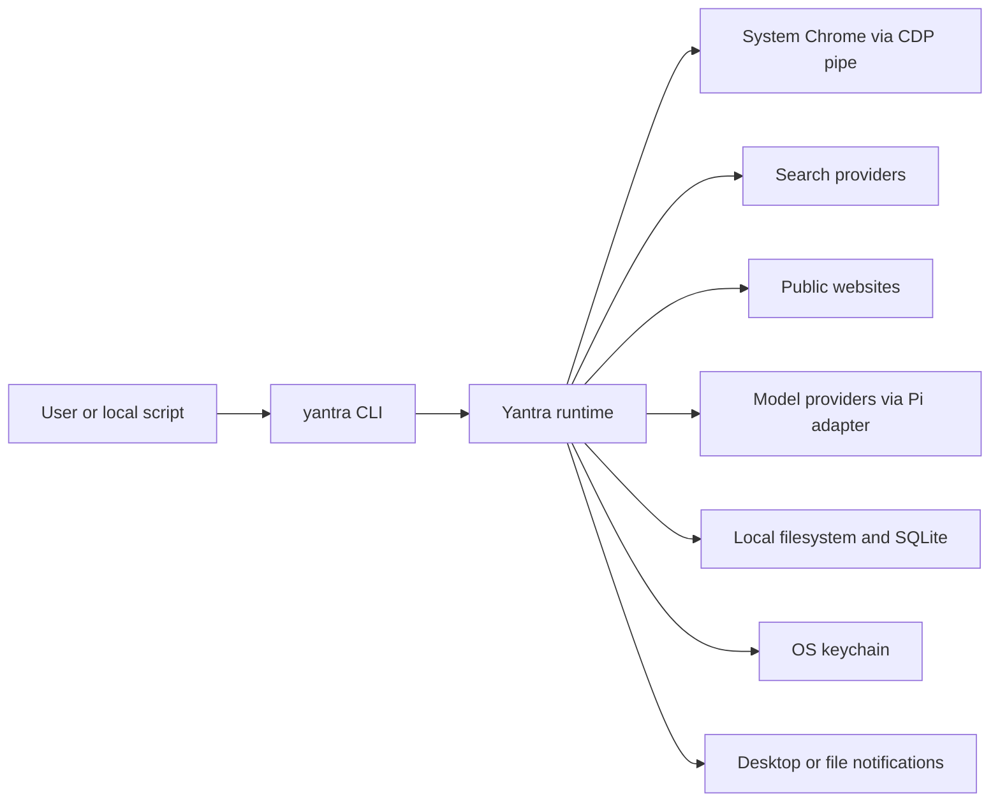
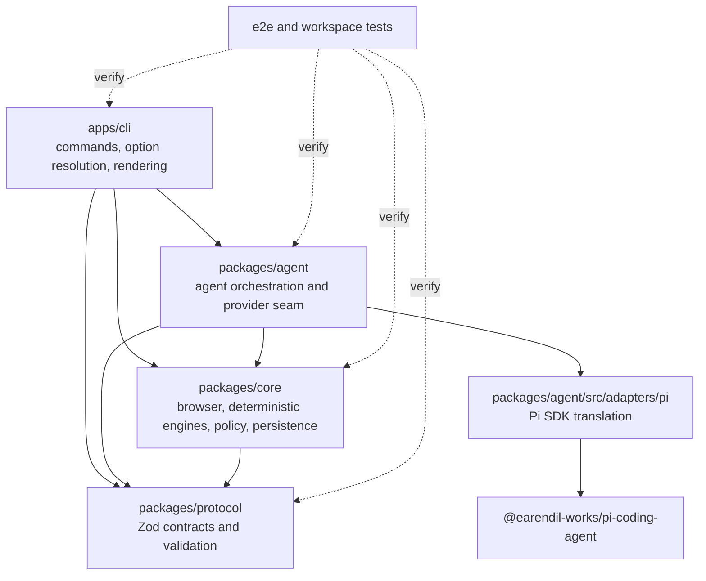
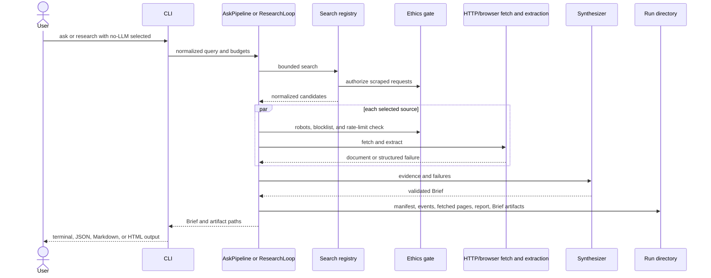
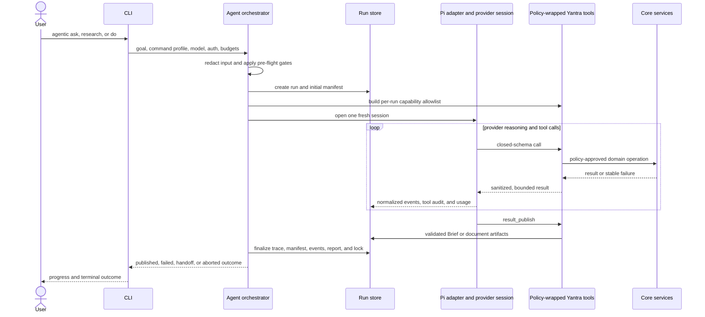
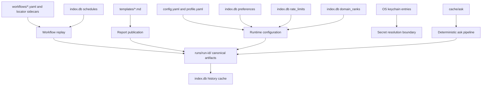

<!-- Generated by spec-lite | skill: document-design -->

# Architecture

## System Context

Yantra is a local-first browser-automation and web-research application delivered as the
`yantra` command-line program. A user can run one-shot web questions, bounded multi-hop
research, live agentic browser tasks, deterministic saved workflows, and a local scheduler.
There is no application server or hosted control plane in the repository: command execution,
policy enforcement, browser control, persistence, and report rendering happen on the user's
machine.

The system integrates with four external boundaries:

- system Chrome, driven through `puppeteer-core` over a CDP pipe;
- public websites and search providers (Google, DuckDuckGo, Brave, and Tavily);
- model providers reached through the Pi coding-agent adapter (Anthropic by default, with
  custom/local models such as Ollama configured through the same provider seam); and
- host services: the filesystem, Node's built-in SQLite, the OS keychain, and desktop or
  file-based notifications.

Yantra treats website content and model output as untrusted. Robots policy, blocklists, rate
limits, URL provenance, budgets, consent, secret resolution, sanitization, validation, and audit
persistence remain application-owned controls rather than prompt instructions.

## Components

The production code is a strict TypeScript, ESM-only pnpm workspace. TypeScript project
references and workspace dependencies establish the build direction: protocol first, then core,
then agent, then CLI. Runtime imports point toward the lower layers as shown below.

### `packages/protocol`

`@yantra/protocol` is the contract layer. Zod schemas define tasks, plans, steps, workflows,
locators, confirmations, discovery records, extraction envelopes, Briefs, report templates,
events, tool-audit entries, and usage ledgers. The package exports inferred TypeScript types and
semantic validators, and its build emits JSON Schema under `packages/protocol/generated/` plus
the generated protocol reference. This lets CLI, agent, core, stored workflows, and artifacts
share one validation vocabulary.

### `packages/core`

`@yantra/core` contains provider-independent domain and infrastructure services:

- browser discovery, launch, profiles, sessions, locator resolution, widget drivers, and the
  unified fill engine;
- finite plan execution, confirmation gateways, checkpoints, captures, output evaluation, and
  saved-workflow replay/resume;
- search, HTTP/browser fallback fetching, Readability/Cheerio extraction, deterministic and LLM
  synthesis ports, multi-hop research, citation validation, and Brief rendering;
- ethics, robots, rate limiting, sanitization, user-input masking, secret resolution, and security
  scope enforcement;
- filesystem stores for workflows, run artifacts, profiles, report templates, and ask cache;
- the local SQLite index for history, preferences, persistent rate limits, schedules, and domain
  ranks; and
- the local scheduler daemon, notification adapters, audit writers, and diagnostics.

Core depends on protocol but never on `@yantra/agent`. That boundary is enforced by lint/static
checks and agent boundary tests.

### `packages/agent`

`@yantra/agent` owns live model-driven execution. `runAgenticTask()` creates the auditable run,
applies deterministic pre-flight gates, builds a per-run service graph, registers only the tools
allowed by the selected command profile, opens one fresh provider session, consumes normalized
events, enforces budgets and retry limits, requires a validated publication, and tears down the
browser and session on every terminal path.

Provider-neutral code depends only on the small `AgentProvider`/`AgentSession` seam. Imports from
`@earendil-works/pi-coding-agent` are confined to `packages/agent/src/adapters/pi/`, which maps Pi
sessions, events, and tool definitions to Yantra-owned types. Pi built-in filesystem, shell, and
editing tools are disabled; each session receives exactly its command-profile Yantra tool
allowlist.

All registered tools pass through one provider-neutral middleware pipeline:

### `apps/cli`

`@yantra/cli` is the executable composition root. `src/bin.ts` delegates to the Commander program
in `src/index.ts`, which registers the public command surface. Commands parse and validate input,
merge flags/environment/profile defaults, choose deterministic or agentic execution before
constructing a provider, build runtime dependencies, render terminal or machine output, record
best-effort history, and map outcomes to exit codes. The CLI does not implement a second agent
reasoning loop.

The principal execution surfaces are:

| Surface                         | Owning runtime                         | Behavior                                                                                                             |
| ------------------------------- | -------------------------------------- | -------------------------------------------------------------------------------------------------------------------- |
| `ask --no-llm`                  | Core `AskPipeline`                     | Single-hop search, concurrent source processing, deterministic synthesis, and Brief artifacts.                       |
| `research --no-llm`             | Core `ResearchLoop`                    | Bounded multi-hop search, coverage tracking, source diversification, deterministic synthesis, and state snapshots.   |
| Agentic `ask`, `research`, `do` | Agent `runAgenticTask()`               | One fresh model session with capability-filtered, policy-wrapped Yantra tools and validated publication.             |
| `run`, `resume`                 | Core `RunOrchestrator`                 | Validated, finite workflow-to-plan replay; optional output synthesis cannot steer execution.                         |
| `daemon`                        | Core `SchedulerDaemon` plus CLI wiring | Polls local schedules and invokes the same workflow orchestrator with a fail-closed unattended confirmation gateway. |

### Test-only workspaces

`@yantra/test-helpers` supplies shared fixtures and no-LLM/provider tag plumbing. `e2e/` depends on
the production workspaces to exercise CLI flows, deterministic research, scheduling, real-Chrome
browser actions, agent orchestration, workflow promotion/replay, golden Briefs, and compatibility
boundaries. Vitest remains the common test runner across every workspace.

## Data Flow

### Deterministic web research

The deterministic `ask` path is selected before any provider session is created. Search results
are fetched and extracted through a shared per-source path guarded by ethics checks. The
synthesizer receives extracted documents and structured failures, validates citations, and writes
the canonical Brief in JSON, Markdown, and inert HTML. `research` repeats the same core stages
within explicit hop, source, time, and LLM-call budgets while persisting `research-state.json`.

### Agentic task

Agentic `ask`, `research`, and `do` share the same orchestrator but receive different tool
allowlists. User-authored values are parsed and redacted before provider or browser state exists.
The runtime creates the run directory before provider validation, constructs policy and evidence
ledgers, opens a fresh Pi-backed session, and records only normalized audit projections alongside
the sensitive run-local provider session. Browser startup is lazy for browser-capable runs. A
successful run ends with `result_publish` producing a protocol-valid Brief or templated report;
plain assistant text alone is not the success contract.

### Saved workflow replay and scheduling

`RunOrchestrator` loads a user-owned workflow YAML, resolves parameters, translates the workflow
to a fixed protocol plan, preflights secrets and safety constraints, then creates the run and
launches Chrome. The executor resolves locators and values step by step, writes checkpoints and
events, evaluates declared outputs, and optionally synthesizes a Brief only after execution has
finished. A model may write that final document when the workflow declares `synthesis.use_llm`,
but it cannot alter steps, branches, loop bounds, or locator repair. `--no-llm` vetoes synthesis;
nested `workflow_run` and scheduled daemon executions hard-disable it.

The scheduler is a lightweight local process. It polls SQLite schedules, skips missed or
overlapping fires, and calls the same orchestrator used by interactive `run`. Its confirmation
gateway can only park and notify; it never grants a protected action automatically.

## Data Model

Yantra has no remote database and no single relational domain model. Durable state is split by
ownership: user-editable definitions and canonical execution records are files, secret material
lives in the OS keychain, and SQLite supplies local indexes and operational tables.

| Store                 | Verified contents and role                                                                                                                                                                                                                             |
| --------------------- | ------------------------------------------------------------------------------------------------------------------------------------------------------------------------------------------------------------------------------------------------------ |
| Config directory      | `config.yaml` for runtime/search/ethics configuration and `profile.yaml` for human-editable preferences and context grants.                                                                                                                            |
| Data `workflows/`     | Canonical saved workflow YAML plus optional locator sidecars; preserved as user-owned input.                                                                                                                                                           |
| Data `templates/`     | Saved Markdown report templates.                                                                                                                                                                                                                       |
| Data `runs/<run-id>/` | Canonical observability record: manifest, events, audit/report files, outputs, checkpoints, captures, fetched sources, Brief/document artifacts, traces, and agent session metadata as applicable.                                                     |
| Data `index.db`       | SQLite schema version 3: `history`, `preferences`, `rate_limits`, `schedules`, `domain_ranks`, and `meta`. History rows reference run IDs logically and can be rebuilt from run directories; the schema declares no foreign keys between these tables. |
| Cache `ask/`          | TTL- and size-bounded deterministic Brief cache keyed by normalized query, search provider, and UTC day.                                                                                                                                               |
| Browser profiles      | Ephemeral profiles in the OS temporary directory by default; workflow-scoped persistent profiles under the data directory when explicitly selected.                                                                                                    |
| OS keychain           | Search/model credentials and workflow secret values. Artifacts persist opaque references and audit metadata, not resolved values.                                                                                                                      |

Path helpers honor the platform's local data, cache, and configuration conventions. Run
directories are created with restrictive permissions where the platform supports them, and
ephemeral browser profiles are cleaned up on close or crash.

## Key Design Decisions

- **Local-first execution and observability.** The CLI and optional daemon run on the user's
  machine. Run directories are the durable audit boundary, while external telemetry is absent
  from the implemented runtime.
- **Schema-first contracts.** Zod is the protocol source of truth, with TypeScript types,
  validators, JSON Schema, and protocol documentation derived from it. This adds generation and
  verification work but prevents hand-maintained contract drift.
- **Layered dependency direction.** Core cannot import agent, and provider SDK types cannot cross
  the agent provider seam. The adapter confinement makes provider-specific change local and keeps
  deterministic execution independent of model availability.
- **Deterministic selection before provider construction.** No-LLM `ask`/`research`, nested
  workflow calls, and scheduled runs do not silently open model sessions. Saved replay has a fixed
  plan before any optional post-run synthesis.
- **Application-owned safety controls.** Sanitization, secrets, consent, URL policy/provenance,
  ethics, budgets, validation, and audit are enforced in code around tools and execution. This
  costs additional middleware and persistence complexity but does not rely on model compliance.
- **Filesystem authority with targeted indexing.** Human-editable workflows and profiles remain
  portable, and run directories remain inspectable. SQLite accelerates queries and persists small
  operational datasets without becoming a content warehouse.
- **System Chrome instead of a bundled browser.** `puppeteer-core` discovers and launches a local
  Chrome executable over a pipe, avoiding a bundled download while making Chrome availability a
  diagnosed host prerequisite.
- **Fail-closed unattended automation.** Scheduled execution reuses the interactive workflow
  engine but swaps in a park-and-notify confirmation gateway, so the daemon cannot self-authorize
  protected side effects.

## Deployment and Runtime

Yantra is built, tested, and run as a Node.js application rather than deployed as a network
service. The repository pins Node 24.15.0 in `.nvmrc`, requires Node `>=24.15.0`, and declares
`pnpm@11.1.0`. All packages are ESM and compile with strict TypeScript targeting ES2022 using
NodeNext module resolution.

The pnpm workspace contains `packages/*`, `apps/*`, and `e2e`. Turborepo drives build, test,
type-check, lint, and clean tasks. The `build` task depends on dependency builds and caches
`dist/**` plus TypeScript build metadata; tests depend on builds. Protocol build first emits
generated contracts, core additionally builds injected browser/locator assets, and the agent and
CLI compile against project references.

At runtime there are two process shapes:

- a short-lived `yantra` CLI process that constructs dependencies for one command, optionally
  launches a run-scoped Chrome child process and provider session, writes local artifacts, then
  closes owned handles; and
- an optional long-running scheduler daemon guarded by a single-instance lock, polling every 60
  seconds by default and spawning the same in-process workflow execution path for due schedules.

GitHub Actions runs lint, type-check, build, and tests on Ubuntu, macOS, and Windows for
`LLM_PROVIDER=anthropic` and `LLM_PROVIDER=none`, with an additional Ubuntu/Ollama cell. Separate
jobs run the static security/import-graph checks, a deterministic/browser release gate
(`build`, `test:no-llm`, static checks, and protocol verification), and an opt-in live Anthropic
smoke when the repository secret is configured. Boundary tests and the static checker enforce Pi
SDK confinement, the core-to-agent prohibition, sanitized model sends, a dependency-light JSON
render path, and exclusion of local index stores from prompt-assembly import graphs.
