<!-- Generated by spec-lite | skill: document-design -->

# Architecture

## System Context

Yantra is a local-first browser-automation and web-research application delivered as the
`yantra` command-line program. A user can run one-shot web questions, bounded multi-hop
research, live agentic browser tasks, deterministic saved workflows, and a local scheduler.
There is no application server or hosted control plane in the repository: command execution,
policy enforcement, browser control, persistence, and report rendering happen on the user's
machine.

The system integrates with five external boundaries:

- a local Chrome or Chromium driven through `puppeteer-core` over a CDP pipe — either a
  Yantra-managed installation under the data directory or an externally installed browser,
  chosen by one resolver;
- the official Chrome for Testing distribution, contacted only by an explicitly consented
  managed Stable installation;
- public websites and search providers (Google, DuckDuckGo, Brave, and Tavily);
- model providers reached through the Pi coding-agent adapter (Anthropic by default, with
  custom/local models such as Ollama configured through the same provider seam); and
- host services: the filesystem, Node's built-in SQLite, the OS keychain, and desktop or
  file-based notifications.

Yantra treats website content and model output as untrusted. Robots policy, blocklists, rate
limits, URL provenance, budgets, consent, secret resolution, sanitization, validation, and audit
persistence remain application-owned controls rather than prompt instructions.

Browser screenshots are the deliberate exception to the normal model-payload sanitizer: pixels
cannot be inspected or masked before transmission. Vision assist is therefore disabled by default,
is exposed only through a conditionally registered agent tool after explicit stored consent, and
persists every transmitted PNG in the owning run directory. Stable logs retain only capture
metadata; the capture file and raw provider session remain private, capture-bearing artifacts.

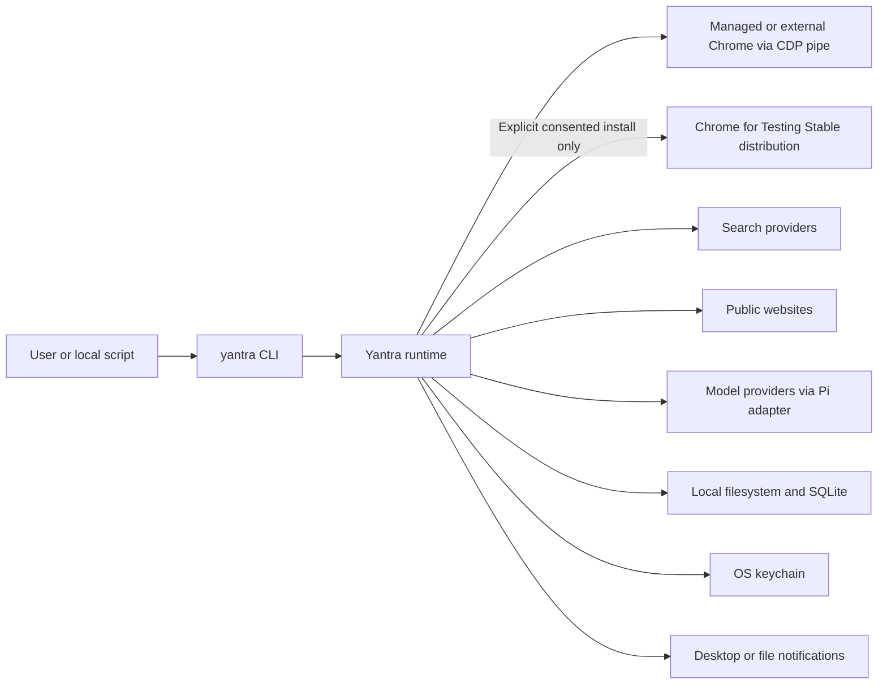

## Components

The production code is a strict TypeScript, ESM-only pnpm workspace. Rather than showing every
workspace import, the component view below shows the dependency layers: arrows point toward the
lower-level dependency. TypeScript project references build protocol first, then core, agent, and
CLI.

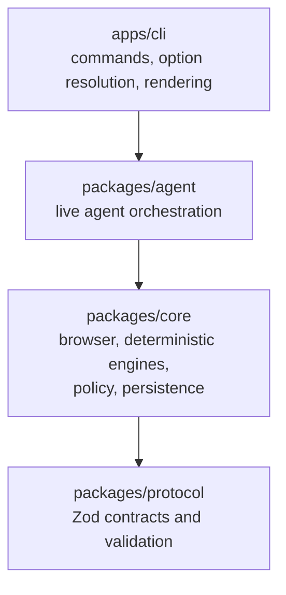

The CLI is the composition root, so it also imports core and protocol for deterministic commands
and shared validation; those direct imports are intentionally omitted from the diagram. They still
point downward. `@yantra/test-helpers` provides fixtures, while workspace and end-to-end tests
verify the production packages without participating in their runtime dependency graph.

### Provider integration boundary

The provider SDK is not another platform layer. It is an implementation detail of the agent
package, isolated behind one small adapter seam:

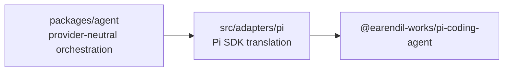

Only `packages/agent/src/adapters/pi/` may import the Pi SDK; boundary tests and static checks
enforce that confinement and prevent core from importing agent.

### `packages/protocol`

`@yantra/protocol` is the contract layer. Zod schemas define tasks, plans, steps, workflows,
locators, confirmations, discovery records, extraction envelopes, Briefs, report templates,
events, tool-audit entries, and usage ledgers. The package exports inferred TypeScript types and
semantic validators, and its build emits JSON Schema under `packages/protocol/generated/` plus
the generated protocol reference. This lets CLI, agent, core, stored workflows, and artifacts
share one validation vocabulary.

### `packages/core`

`@yantra/core` contains provider-independent domain and infrastructure services:

- browser resolution, compatibility probing, managed-installation coordination, launch, process
  supervision, profiles, sessions, locator resolution, widget drivers, and the unified fill
  engine;
- finite plan execution, confirmation gateways, checkpoints, captures, output evaluation, and
  saved-workflow replay/resume;
- search, HTTP/browser fallback fetching, Readability/Cheerio extraction, deterministic and LLM
  synthesis ports, multi-hop research, citation validation, and Brief rendering;
- ethics, robots, rate limiting, sanitization, user-input masking, secret resolution, and security
  scope enforcement;
- filesystem stores for workflows, run artifacts, profiles, report templates, and ask cache;
- the local SQLite index for history, preferences, persistent rate limits, schedules, and domain
  ranks; and
- the local scheduler daemon, notification adapters, audit writers, and diagnostics.

Core depends on protocol but never on `@yantra/agent`. That boundary is enforced by lint/static
checks and agent boundary tests. The protected-action lexicon lives in core for that reason: the
obstruction protocol's auto-clearance veto runs there, so `PROTECTED_ACTION_RE` is defined in
`packages/core/src/interaction/protected-actions.ts` and re-exported unchanged by the agent tool
layer rather than injected into core by a caller who could omit it.

#### Configuration and storage authority

`packages/core/src/browser/paths.ts` is the single authority for the Yantra home and primary storage
roots. It resolves `YANTRA_HOME` when set and otherwise uses `~/.yantra` on every platform; it does
not split state between XDG, AppData, and home-directory conventions. Configuration, preferences,
policy sidecars, and storage defaults all descend from that root. Only the data and cache roots are relocatable:
`packages/core/src/config/resolved-paths.ts` applies environment override, then `config.yaml`, then
`<home>/data` or `<home>/cache`. Its synchronous result is memoized because path consumers are
synchronous; config-writing commands explicitly clear that memo. An unreadable or malformed early
path configuration falls back to defaults with one warning so path discovery cannot fail before CLI
error handling exists.

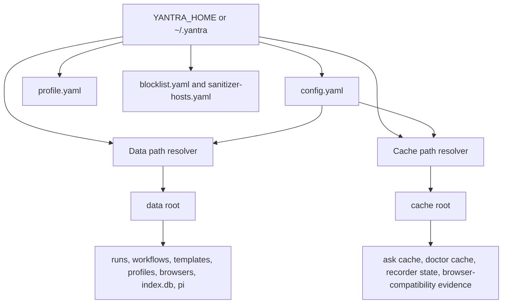

`config.yaml` is installation state: storage locations, registered models, credential references,
search availability, ethics policy, retention, and the explicit Pi-auth path. A single strict Zod
schema supplies defaults and rejects unknown or malformed keys; `loadConfig()` returns a typed
`Result` instead of silently replacing a bad file. `profile.yaml` is user preference state: model
selection, output defaults, locale, personalization, sensitive-context grants, and agent limits.
The two exported dotted-key sets let the CLI redirect a key to `yantra config` or `yantra prefs`
instead of writing it to the wrong file.

Credential-bearing configuration stores only parsed `${env:NAME}` or `${secret:key}` references.
Search providers resolve those references at the outbound request boundary, with the legacy named
keychain entry as the fallback when no reference is configured. Renderers recursively project
references back to their safe text form. Registered models similarly remain Yantra-owned data:
the Pi adapter deterministically projects `config.yaml`'s model registry to
`<data>/pi/models.json` immediately before constructing Pi's `ModelRegistry`; the projection may
contain a reference but never resolved credential material.

#### Browser resolution, compatibility, and process ownership

Every browser-backed operation — agent tools, deterministic replay, browser fetch, the workflow
recorder, and diagnostics — receives the same composed seam, `BrowserRuntimeServices` from
`packages/core/src/browser/runtime-services.ts`: a resolver, a compatibility service, a managed
coordinator, a read-only managed-state reader, and a lazily constructed managed installer. An
optional install-offer gateway is present only when a human-facing caller injects it. Building this
graph is inert. It starts no browser, takes no lock, reads no network, and can trigger no download;
a browser exists only once a caller actually launches. The CLI runtime factory, the `ask` and
`research` pipelines, and the agent
orchestrator all build their provider through the one `createSelectedBrowserProvider` entry point
instead of constructing their own, and the recorder consumes the same services directly, so "the
same browser everywhere in a run" is structural rather than a convention each factory has to
remember. A per-invocation selection travels through that seam as an ephemeral value and is never
written to configuration.

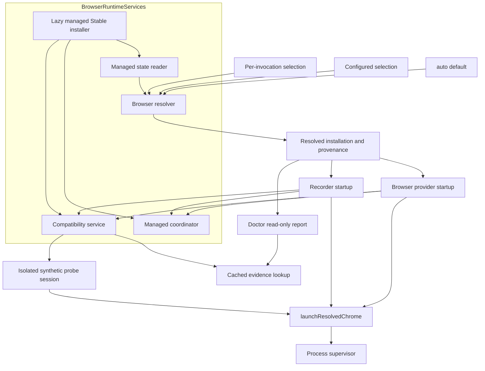

A `BrowserSelection` is a source — `auto`, `managed`, or `system` — plus an optional absolute
executable path that is legal only with `system`, because `auto` and `managed` describe how to
find a browser and pairing either with a literal path would mean two selections at once.
Precedence is the per-invocation selection, then whatever a persisted-selection reader supplies,
then `auto`, and it applies to the selection as a whole rather than merging field by field: an
invocation that asks for `system` with no path therefore clears a configured custom path instead
of inheriting it. The reader is an injected boundary and its default reports no configured
selection, so `auto` is the effective installation-wide answer. `auto` prefers the single
ready managed installation under `<data>/browsers` and otherwise falls back to external
discovery. A corrupt managed record fails closed with remediation rather than quietly running a
different browser than the machine is set up around. Resolution itself is read-only in the
strongest sense — it never downloads, never launches, and never contacts a version server — and
its result carries ownership, selection origin, selection reason, channel, and the managed
identity behind it, so diagnostics report the browser a run would actually use.

Ownership is decided canonically rather than by how the caller spelled the path. An explicit path
that lands inside the managed root is managed-owned even when it arrived through `system`, so it
must be exactly the ready executable and it obeys managed coordination. A path whose lexical
containment and canonical containment disagree — a symlink or junction crossing the managed root
boundary in either direction — is refused as an invalid selection instead of being resolved
either way.

The managed tree has one rule: at most one ready pointer, and any `installation-*` child that
pointer does not name is an orphan. That single rule stands in for candidate bookkeeping, a
transaction phase machine, and a crash-recovery routine, none of which exist. A candidate under
construction is an orphan with a live owner; an abandoned candidate and a superseded installation
are orphans with none. Orphans are never selectable because selection reads the pointer, and the
state reader that enumerates them deletes nothing. Managed executable paths are recomputed from
the recorded relative identity through `@puppeteer/browsers` rather than persisted absolute, so a
relocated data directory still resolves and a record that disagrees with the on-disk layout is
reported invalid.

#### Managed Stable acquisition

Managed acquisition is a separate mutation path from resolution and launch. It can be entered only
by `yantra browser install` or by the browser provider after a human accepts the optional first-run
offer. `LocalManagedInstallService` requires a one-operation `DownloadConsentRecord`; an absent
record returns `consent-required` before a mutation lease or network boundary is reached. If a ready
managed record already exists, installation is an idempotent local result: it reads cached
compatibility when possible, collects unowned orphans, and does not resolve Stable or start the
helper.

For a new installation the service first claims the existing exclusive managed-mutation lease. A
live managed-browser reservation or another mutation therefore produces `operation-in-progress`
before helper I/O. Under that lease it collects abandoned children and runs local preflight:
Chrome-for-Testing host support, executable ZIP tooling (`unzip` on Unix-like hosts, or Windows tar
and PowerShell alternatives), proxy capability, destination writability, and at least 750 MiB of
free space. Preflight never installs system packages or elevates privileges.

Network resolution, download, extraction, and Windows finalization run in the compiled
`managed-install-helper.js` child under `process.execPath`, not in the CLI event loop. The parent
spawns without a shell, hides its own process on Windows, passes an allowlisted environment with
`NODE_USE_ENV_PROXY=1`, and validates versioned IPC messages with Zod. The helper uses the pinned
`@puppeteer/browsers` API and official provider to resolve only Chrome Stable and install it into
the operation's exact `installation-<id>` child; download-base overrides and unrelated environment
values do not cross the boundary. `installDeps` is fixed to `false`, so neither the helper nor the
upstream API installs Linux packages.

The parent owns the whole-operation, metadata, stalled-transfer, cancellation, and process-tree
bounds. Interruptible cancellation asks the helper to stop, then terminates and waits for the
helper and extraction descendants. Windows upstream finalization can synchronously run
`setup.exe`, so that phase is reported non-interruptible: a cancellation remains pending until the
helper can acknowledge it, and completion is not reported before the helper exits. Downloads are
not resumable; cancellation, timeout, or transfer failure can leave only the candidate child, not
a ready installation.

After acquisition, the parent recomputes and checks the executable, then uses the shared
compatibility service through a candidate-probe permit bound to the active lease, exact child, and
executable. Only a passing automation probe can reach publication. Publication writes a
mode-restricted temporary ready record and atomically renames it to `ready.json`; failures before
that rename leave the previous pointer unchanged, while the candidate remains an unselectable
orphan. Chrome for Testing supplies no artifact hash through this path, so the acquisition integrity
boundary is the official provider over TLS; local readiness means executable presence plus the
capability probe, not a claimed byte checksum. The permit is revoked and the mutation lease released
on every path.

Orphan collection has no recovery semantics. It deletes only unowned children whose names match the
managed child grammar, refuses the ready child, non-direct children, non-directories, and canonical
symlink or junction escapes, and skips a child with a live mutation owner. Collection runs before a
new candidate and after successful publication. An individual deletion failure is reported for
later retry; a post-publication cleanup failure does not roll back a browser that has already been
verified and published.

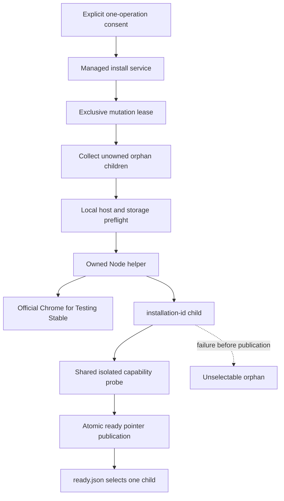

Download consent is capability-shaped rather than a global preference. The explicit command prints
the managed destination, approximate 200 MB cost, restart-from-zero behavior, and assurance that
external Chrome is untouched before prompting. `--yes` constructs the record directly; otherwise
only a TTY can prompt. Non-TTY and JSON command use without `--yes` fails validation before the
install service is called. Consent is not persisted and authorizes only that one install request.

The first-run offer is narrower still. `LocalBrowserProvider` considers it only when automatic
selection returns `missing`; explicit missing selections and resolved-but-incompatible browsers keep
their original failure. Interactive, non-JSON `run`, `resume`, `ask`, `research`, and `do` callers
inject the human gateway. The provider serializes concurrent offers and spends the opportunity at
most once per process; acceptance installs and then re-runs resolution before startup continues.
Decline, prompt cancellation, and the bounded prompt timeout fail closed. Daemon and scheduler
execution, nested `workflow_run`, JSON and non-TTY invocation, diagnostics, initialization, and
ordinary startup without a gateway cannot prompt or download. There is no model-visible install or
update tool.

Support is a declared capability table in `driver-compatibility.ts`, not a minimum browser
version. Each row states an id, why the primitive is required, which callers require it, and its
prerequisites: the CDP pipe version, page evaluation, DOM handle collection, click-to-replace
text entry, frame tokens, and popup session association for automation, plus the recorder's
binding, preload, and Page-domain rows. The recorder set is the automation set plus those three,
which is what makes automation-only evidence unable to approve a recording. The pairing this
repository tests — `puppeteer-core` `25.10.0` against Chrome for Testing `152.0.7977.75` — is a
recorded baseline rather than a floor or a target. Chrome ships Stable faster than the driver pin
moves, so an installed build outside the pairing is the normal case: it reports
`capability-checked`, and only an exact match reports `tested`.

There is exactly one probe implementation and one session contract behind it. The probe always
launches its own isolated headless synthetic session with its own ephemeral profile — never the
session the user is about to work in — and always closes that session and that profile, on
success and on failure alike. It reaches no task URL, no personal profile, and no provider
session by construction. Three entry points funnel into that one body: the launch path, which
probes only when no valid cached evidence exists; an unconditional fresh check; and an internal
candidate probe, authorized by an unforgeable permit bound to one operation's lease, candidate
tree, and executable. Rows run in prerequisite order and a row whose prerequisite failed is
reported `not-run` naming that prerequisite, so the output states one cause rather than a
cascade. A probe that cannot start at all is classified rather than collapsed: missing runtime
libraries, whose remediation is rendered from the installation's own `deb.deps` file so it names
actual packages; a capability failure, which names the failing primitives; or a launch-environment
failure.

Evidence is cached under `<cache>/browser-compatibility`, keyed by canonical executable path,
version, stat fingerprint, host platform and architecture, driver version, probe revision,
capability-table hash, and probe profile. Editing the capability table therefore invalidates
cached evidence by construction rather than by anyone remembering to bump a revision. Only a
successful result counts as evidence — failures are retained for diagnostics — and stored content
is re-verified against the question rather than trusted because the filename matched. Anything
else reads back as `unverified`, an honest answer a caller can report without launching a
browser.

Concurrency across processes uses two claims that are mutually exclusive at claim time: any
number of shared use reservations, and at most one exclusive mutation lease, both taken under a
short `proper-lockfile` metadata mutex over `<data>/browsers/coordination`. Readiness is
re-validated under that mutex against the installation the caller already resolved, because an
update between resolution and reservation would otherwise leave a claim on a tree that is already
an orphan. Liveness is judged by process creation identity rather than age: the OS reuses PIDs, a
stale record could otherwise point at an unrelated live process, and "cannot tell" is kept
distinct from "safe to reclaim" so an uncertain owner fails conservatively in the direction of
not deleting.

`BrowserProcessSupervisor` owns a browser child from spawn to verified exit. A polite close is
given a bounded grace period, then escalation terminates the process tree — `taskkill /T /F` on
Windows, `SIGTERM` followed by `SIGKILL` elsewhere — and exit is proven only by the child's `exit`
event. A dispatched signal, a Puppeteer disconnect, and `child.killed` are explicitly not exit
tests. A managed reservation is released only after that proof, and a startup that never produced
a process releases its reservation only with an explicit never-spawned proof, so nothing can
authorize deleting a tree a live Chrome still holds open.

All of that converges on one launch function, `launchResolvedChrome(opts, installation, profile,
ownership)`, where ownership is a discriminated input — an external browser, a managed
reservation, or a candidate probe permit — rather than something each caller arranges for itself.
Exactly one runtime `puppeteer.launch` call remains in the repository. A late browser that
arrives after startup was abandoned is still closed and awaited, because the settlement handler is
registered before the first await.

Provider startup runs one sequence for every caller and rolls back completely at whichever step
fails: validate options, resolve identity, acquire managed ownership, verify compatibility,
create the requested profile, re-stat the executable, and launch. There is no readiness-bypass
flag, so a caller cannot opt out of the compatibility gate. The single reservation is held
continuously across both the probe and the task launch rather than taken twice. The re-stat exists
because a binary replaced between the probe and the launch would otherwise let evidence about the
old build authorize the new one; a changed fingerprint re-resolves and re-verifies before any user
navigation. Rollback removes only an ephemeral profile that startup itself created — a workflow or
explicit profile the user owns survives a failed startup untouched.

The workflow recorder is a caller of that same seam rather than a second implementation. It
resolves through the same resolver, takes the same managed reservation, launches through the same
function, and requires the **recorder** capability profile before any recording initialization or
user navigation. It keeps its own caller-required differences — a visible window, its
Yantra-owned recording profile directory, and its binding/overlay contract — and its startup is
rollback-protected so a failure leaves behind no browser, no CDP session, and no reservation, and
does not pretend recording began.

Diagnostics read the same provenance without launching anything. The `chrome.detected` check
reports the installation the resolver would actually select, and `chrome.compatibility` reports
cached evidence, an honest `unverified` when there is none, or the failing capability rows —
never a browser started to manufacture an `ok` result.

#### Puppeteer migration and browser-object ownership

Core pins `puppeteer-core` to exactly `25.10.0` and `@puppeteer/browsers` to exactly `3.2.2`. The
latter is used in production inside the isolated helper to resolve and install official Chrome for
Testing Stable, and in the parent/runtime to recompute a managed executable path from its recorded
build identity. The migration job separately installs the fixed Chrome for Testing build
`152.0.7977.75` into a caller-owned test cache and passes
its absolute executable path through the test-only `YANTRA_TEST_BROWSER_PATH` seam. A manifest records
the build, detected platform, cache, and executable, and the harness refuses a missing executable,
manifest/path disagreement, or unsupported platform rather than falling back. Each suite also uses
an isolated temporary `YANTRA_HOME`, and expresses the provisioned executable as an ordinary
`system` selection with an explicit path. The harness is a test provisioner, not an installer: it
populates a caller-owned cache and never publishes a managed ready pointer.

The only intentional input-simulation change in the driver migration is how a fill replaces existing
text. The deterministic fill paths focus the element, hold platform select-all (`Meta+A` on macOS,
`Control+A` elsewhere), and release the modifier in `finally` before typing. They do not translate the
old triple-click marker to Puppeteer's v25 `count: 3`, which would dispatch three real clicks and could
toggle a widget while selecting. Ordinary clicks use `count: 1`. Saved workflow schemas and replay
artifacts are unchanged, and a source-boundary test rejects any reintroduction of `clickCount`.

Browser resources have explicit, public ownership boundaries:

- `AgentBrowserController` binds one exact popup callback and one dialog callback to each active
  Puppeteer `Page`. A monotonically increasing page generation makes callbacks from an adopted or
  torn-down page stale. A declared-popup waiter is registered before click dispatch and shares the
  permanent listener's `WeakMap<Page, Promise<void>>` capture, while ordinary clicks pay no waiter.
  Capture snapshots the opener URL, settles `about:blank` within a bound, retains at most one
  same-site popup, and rechecks its live URL before policy-authorized adoption. Adoption removes the
  opener's exact callbacks, installs fresh callbacks on the adopted page, invalidates old refs, and
  closes the opener; teardown removes all registered callbacks and drains capture tasks. Agent popup
  capture therefore uses page `popup` events, not browser Target tracking.
- `RecordingSession` owns the browser, main-page and browser-level CDP sessions, and the exact
  overlay listener functions installed on every instrumented session. Its browser-level CDP session receives
  only `Target.*` discovery, attach, and detach traffic. `PopupHandler` correlates each page target
  with the session ID returned by `Target.attachToTarget`, then obtains that exact public child session
  through `browserCDP.connection()?.session(sessionId)`. Only the main-page or matching child-page
  session receives `Page.enable`, `Runtime.enable`, the recorder binding, preload, and immediate
  injection. Pending target ancestry admits descendant popups while their parent initializes, and a
  five-second bounded lookup reports `recording_degraded` instead of substituting the browser session.
  On target close, failed instrumentation, stop, abort, or disconnection, recording listeners are
  removed by their original function references before the handler detaches its owned child session;
  disposal is awaited and idempotent.
- `PuppeteerInjectedScriptHost` represents the main frame as `main` and maps each attached non-main
  Puppeteer `Frame` to a host-unique opaque token in a `WeakMap`. Resolution searches the host page's
  current `frames()` and accepts only a token already minted for that live Frame object. Tokens remain
  stable for one attached frame but are rejected across hosts and after detach or replacement. They
  are locator-session state only: no token is stored in workflow YAML, recording metadata, or run
  artifacts, so persisted workflows require no frame migration.
- `collectComposedInteractables` owns every intermediate `JSHandle` acquired during its single page
  scan. Returning successfully transfers only the element handles occupying the positional result
  slots to the caller; partial conversion or acquisition failure disposes all acquired intermediates
  and untransferred elements exactly once. Controller refs dispose their transferred handles when
  invalidated. Vision capture separately owns a page-scoped CDP session and detaches it in `finally`;
  its set-of-marks overlay is removed on both capture success and failure without changing viewport
  dimensions.

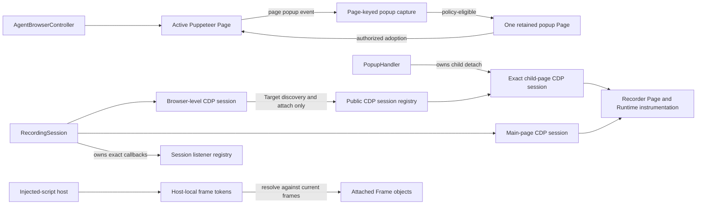

#### Composed-tree observation and ref minting

Observation walks the **composed** tree, so a control inside an open shadow root is nameable and
addressable. `scanInteractablesInPage({ withElements, max, selector })` in
`packages/core/src/discovery/interactable-scan.ts` runs one in-page pass with an explicit stack —
not recursion, so a pathological tree is bounded by `max` rather than by the JS call stack — and
descends into `element.shadowRoot` wherever it is non-null, to a shadow depth of 16. **Open** roots
only: the platform returns `null` for a closed root, so a closed-shadow control is unreachable
rather than filtered. There is no closed-root branch to get wrong, and no piercing library or DOM
tagging is used to manufacture one. The scan sets no attribute, injects no marker, and adds no
node.

Membership is the same candidate set the flat query used, applied per element with `matches()`
instead of as one `querySelectorAll`, because only a per-element test can be carried across a
shadow boundary. Three name and ancestry computations are root-scoped rather than
document-scoped as a consequence: `aria-labelledby` id lookup and `label[for=…]` resolve against
`element.getRootNode()` — ids are scoped per shadow root, so a same-valued document id cannot leak
in — while group and scope walk the composed ancestor chain (`parentElement`, else
`getRootNode().host`), which a `parentElement` walk would terminate at the boundary, reporting a
shadow-hosted control inside a labelled dialog as ungrouped and page-scoped.

The pass returns `{ records, elements }`. `elements` is a **superset** of `records`: an element can
match the candidate selector and still carry a role the record projection has no kind for (`tab`,
`menuitem`, or a caller-supplied selector's own additions), and it stays addressable regardless.
`RawInteractable.elementIndex` indexes into that array. The record also carries `composedScope`
(`document` or `open-shadow`), `rootNodeDepth`, `focused`, and `container`, which are internal
diagnostics: they are never projected into `AgentInteractable` and never reach the model, because
observation forwards interactables to the model wholesale and a field that reached the projection
would become a payload contract change.

`focused` and `container` exist for the page delta below, and both are answered by work the pass was
already doing. `focused` compares the element against its **own** root's `activeElement`, because
`document.activeElement` reports the shadow _host_ for a control inside an open shadow root, and a
host is not the control the page is typing into. `container` names the dialog, overlay, listbox,
menu, or grid the element sits in as the same `{ role, name }` pair the obstruction protocol uses,
and it falls out of the ancestry walk `computeScope` performs per candidate. That walk now continues
to the **outermost** matching visible ancestor instead of stopping at the first, matching
`overlay-dismiss.ts` and the obstruction classifier's outermost-container selection: a control inside
a suggestion listbox inside a modal belongs to the modal, which is both the thing a person would say
opened and the thing FEAT-033 would name as the obstruction. `scope` is unaffected — a match at any
depth still means `'dialog'` — and a per-scan memo names each container once however many controls it
holds, so a modal with two hundred controls does not recompute one accessible name two hundred times.
There is no second query, no second traversal, and no DOM mutation.

`collectComposedInteractables(page, { max, selector? })` in
`packages/core/src/discovery/composed-handles.ts` is the single handle-collection implementation.
`AgentBrowserController.observe()` takes one `evaluateHandle` scan and claims handles by
`elementIndex`; it holds no interactable selector of its own. The rationale is worth stating as a
contrast, because it is why the shape is what it is: the arrangement this replaced paired a record
list from one traversal with a handle list from an independent `page.$$` query, held in step only
by a doc comment demanding two selector constants stay byte-identical. Drift there never failed
loudly — it silently bound every ref to the wrong element. Same pass, same array, so the
correspondence is structural. A source-boundary rule in
`packages/core/tests/boundary-rules.spec.ts` ("mints interactable handles from exactly one composed
traversal") pins it, including that exactly one module in `packages/*/src` walks `element.shadowRoot`.

Deterministic replay shares the walk and nothing else. The replay `WidgetPort.observe()` in
`packages/core/src/executor/step-handlers/fill-element.ts` passes its own `INTERACTABLE_SELECTOR`
as the `selector` option rather than driving a separate query, and keeps its own `describe()`
projection and cap. That selector is deliberately wider — it includes `[role="gridcell"]`, which the
agent observation has no kind for — because the two paths are separate actionability and
observation contracts and are not unified. Sharing the walk is what keeps a promoted workflow from
silently losing the controls the agent could see.

#### Pointer reachability and the obstruction protocol

The agent controller and the deterministic executor hold two separate actionability contracts, and
they deliberately want different answers to the same signal. `assertActionable` checks only the
facts that do not depend on scroll position — connected, laid out, not disabled — and is unchanged.
Pointer reachability is a distinct stage that runs **after** the existing hover/scroll settle:
`preparePointerTarget` obtains `ElementHandle.clickablePoint()`, hit-tests that exact viewport
coordinate through the composed tree, and `dispatchAt` then dispatches the pointer event at the same
value object. This is a second, differently shaped composed-tree mechanism, not the observation walk
above: it is a **point** descent, re-running `elementFromPoint` inside each open shadow root the hit
lands on and then walking composed ancestors back toward the target, rather than a traversal of the
whole tree.
Testing before the scroll is forbidden by a live below-fold regression, and a centre-point test
cannot satisfy clipped or off-centre quads.

When the point belongs to something else, the interception is classified structurally — never by
host, brand, or URL — into one of four kinds, in fixed precedence: `busy-indicator`,
`modal-dialog`, `fixed-overlay`, `plain-overlay`. Busy wins first on purpose: reading a spinner as
a modal turns a transient into a terminal and loses a retry the page would have satisfied. The
outermost overlay container in the intercepting node's bounded ancestry supplies the reported
identity, so a listbox nested inside a modal reports the modal.

Diagnostic work is paid for only on the obstructed path. Once interception is detected, one bounded
obstruction-scoped read describes the controls inside the obstruction's **own subtree** and mints
the dismiss-shaped ones as real refs on the live ref map — additively, so the caller's ref is never
invalidated and no existing id is renumbered. Every offered ref resolves through `resolveRef`, which
is what makes naming it in a hint legal at all.

At most one clearance press happens per **top-level tool call** — the middleware opens that boundary
with `beginToolCall()`, so a `browser_fill_form` spanning many fields and many typing rungs shares a
single allowance. Three independent gates decide whether anything may be pressed: a strict
close/dismiss/decline allowlist, the `PROTECTED_ACTION_RE` veto, and subtree containment. The
allowance is spent before the press so a throw cannot buy a second, there is no recursion, and the
original coordinate is re-tested afterwards. Anything the engine will not press is handed to the
agent as a ref instead, where `browser_click`'s existing confirmation gate applies as usual.

A blocked action reports the stable code `ELEMENT_OBSTRUCTED` — never `ELEMENT_HIDDEN`, because a
covered element is visible and conflating the two sends the agent to re-observe when the fix is to
dismiss. `details.kind` is required and total over the message catalog, and it drives the internal
retry disposition (`busy-indicator` transient, everything else terminal after the one clearance).
That is a different question from the model-visible `retryable` flag, which stays true for every
kind because a corrected retry after dismissing an offered ref genuinely can succeed. The overlay's
accessible name is page-derived and passes the run sanitizer at the agent seam **before** the
message is rendered, so the model-visible sentence and the recorded `details` cannot disagree;
`kind`, `point`, and the clearance fields are fixed enums, numbers, and booleans carrying no page
text and are logged verbatim. The clearance rides the attempt ledger as a `clear-obstruction`
record on the `where` axis.

#### Container scrolling and virtualized option lists

`WidgetPort` exposes `scrollContainer(container, step?)`, returning a `ScrollFrame` of `scrollTop`,
`scrollHeight`, `clientHeight`, `moved`, and `atEnd`, or `null` when the container owns no
scrollable region — a normal named outcome rather than a failure. `WidgetBudget.maxScrollSteps`
bounds it, defaulting to 8 in `defaultWidgetBudget`, declared on the budget for the same reason
`maxPagingSteps` is: a caller can lower it and a test can pin it.

One in-page implementation, `scrollContainerInPage` in `packages/core/src/widgets/scroll.ts`, backs
every port — the `AgentBrowserController`, the deterministic replay port, and the JSDOM
`WidgetTestPort` — and reaches the agent through `browserWidgetPort`. It resolves the nearest region
whose computed **`overflowY`** is `auto` or `scroll`, searched from the container's own subtree
outward to the container itself; the longhand is read deliberately, because the `overflow` shorthand
computes to `''` on a page that set only `overflow-y`, which is exactly the case this exists for.
`window`, `document.scrollingElement`, `document.body`, and `document.documentElement` are excluded
by construction, so advancing a list can never move the whole page. It is a mutation, classified as
one in the gauntlet's `PORT_ACTION_KIND` table, and reachable only from a driver's `drive()` — never
from `detect()` or `detectOpen()`, because detection must not mutate page state.

`scanVirtualOptions` in `packages/core/src/widgets/option/virtual-list.ts` walks a virtualized list
window by window on top of that primitive. `optionIdentity()` is content-derived —
`normalizeText(name)`, a `\u0000` separator, then the role — and that is a requirement rather than a
style choice: a virtual list recycles its DOM nodes, so a node- or path-derived identity would
report the same recycled row as new forever and no-progress could never be detected. Sharing
`normalizeText` with ranking and commit verification keeps dedup and matching from drifting into two
ideas of sameness. Every exit is named by the closed `VirtualListStop` set — `matched`,
`not-scrollable`, `reached-end`, `no-new-options`, `scroll-position-unchanged`, `step-cap`,
`budget` — because an unnamed exit is an unbounded loop waiting to happen. Termination is
**identity-first**: `atEnd` and the layout metrics are recorded as corroborating evidence only,
since an environment without a layout engine reports them as `0`, which would make `atEnd`
vacuously true and end the scan before it began.

The scan is wired into `listboxDriver.drive` behind a structural entry condition — it runs only when
ranking the already-collected first window returns `kind: 'none'` — and the caller passes that first
window in rather than having it re-read. A list whose target is already mounted therefore charges
zero scrolls and zero extra reads, and the gauntlet asserts that zero by counting the operation.
Bounds are `MAX_TRACKED_OPTION_IDENTITIES` at 500 tracked identities, `maxScrollSteps` at 8, and
offered labels at the existing `MAX_RANKED_OFFERED` of 10; scrolls are charged against
`WidgetBudget.maxActions` like any other action.

No new stable error code was added. A list that genuinely lacks the value still fails as
`WIDGET_TARGET_UNREACHABLE` with cause `value-not-offered`, now carrying evidence deduplicated
across every window that was mounted rather than the first window alone. The scan discloses its work
as driver evidence — the bounded `scroll_steps` count and the `scroll_stop` token, and nothing else —
which the runner records on the rung that ran the driver, on the `what` axis: that rung varies what
the widget has been given a chance to offer, not the target node or the typing mechanics. Both keys
are allowlisted in `SERIALIZED_EVIDENCE_KEYS`, so no page text and no host can reach the ledger
through them.

#### Choice integrity and offered-label receivers

An `offered` array is an actionable menu, not a dump of everything clickable in a popup. Choice
selection therefore has one provider-independent structural resolver,
`resolveIndistinguishableChoice` in `packages/core/src/interaction/choice.ts`. Callers supply the
exact label they would expose and the already-resolved container path; the resolver then narrows by
container membership, enabled/visible state, and the page's selected state. Each filter is applied
only when it leaves at least one candidate and actually narrows the pool. If the surviving normalized
labels differ, the result remains `ambiguous` and belongs to the caller. If the labels are identical,
the model cannot make a meaningful choice, so the resolver takes the path-lexicographic first element
in document order and returns a `ChoiceSubstitution` with the indistinguishable count, one-based
position, applied tie-break rungs, and model-visible label.

Calendar, option-list, virtual-list, combobox, and plain-text ranking paths use that resolver rather
than maintaining family-specific tie-breaks. A substitution is visible in the successful tool result,
and `substitutionEvidence` projects its count, one-based position, and applied tie-break rungs into
the driver's `evidence` as `substituted`, `substitution_position`, and `tie_break`, which the runner
records on the rung verdict that produced them. The page-derived label is deliberately omitted from
that verdict evidence; it remains subject to the normal model-result sanitizer. A genuine `WIDGET_AMBIGUOUS_CHOICE` consequently contains
pairwise-distinct labels the model can name, while byte-identical offers are resolved and disclosed.

`collectChoices` separates choice discovery from the broader `collectCandidates` helper used for
widget dismissal. When a resolved container has explicit `option`, `menuitem`, or `treeitem`
descendants, only those descendants can be ranked, offered, or clicked; buttons, links, and other
container chrome are counted as scoped out. Containers without such descendants retain the existing
homogeneous clickable-child fallback for compatibility. In both tiers, any label matching the shared
`PROTECTED_ACTION_RE` is vetoed before ranking and cannot be offered or selected. The returned
`WidgetChoiceSet` records whether option semantics were declared and carries only `scopedOut` and
`vetoed` counts, never the filtered page text. On the two failures that otherwise tell the caller to
name an offer (`no-suggestion-matched` and `value-not-offered`), a container with no declared option
semantics withholds `offered` entirely and uses `no-options-offered`, whose hint asks for observation
rather than naming a nonexistent retry capability.

The date family also owns a real receiver for its month-prefixed offered labels. Values matching the
stable `YYYY-MM: <cell-name>` shape are parsed as opaque text rather than as ISO dates or ranges. The
fill engine detects a calendar-grid driver for the target and routes the token to
`selectByOfferedCalendarLabel`, which reopens or reuses the resolved calendar, projects each live cell
with the same month/name format, matches the token without parsing its human-readable tail, applies
the shared choice resolver, clicks the selected cell, and verifies the committed value. This makes a
calendar's instruction to re-issue one of its exact labels an executable round trip rather than a
fall-through to typeahead behavior.

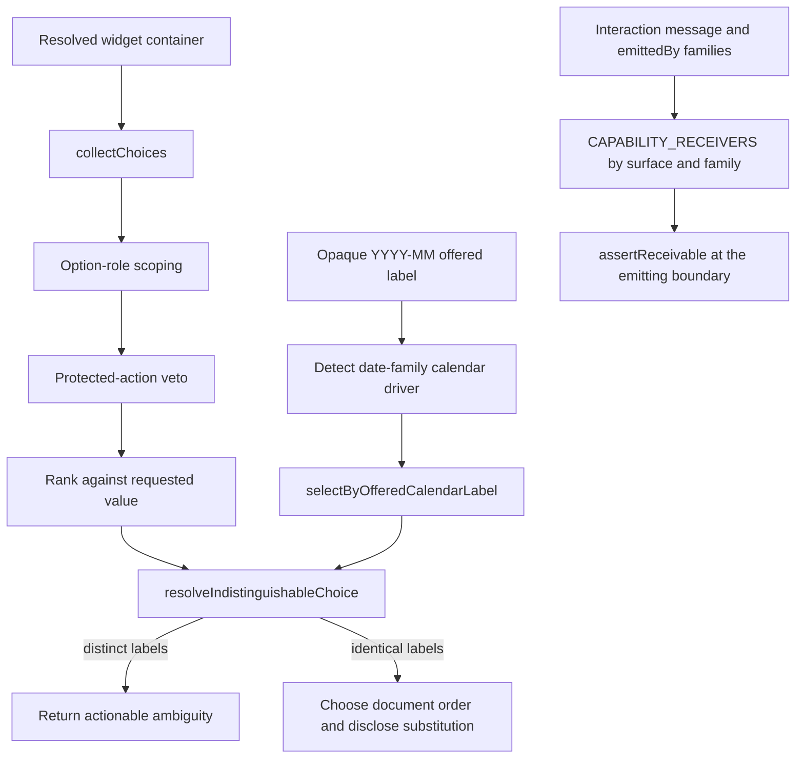

Advice receiver validation is family-specific. Capability-bearing message templates declare their
`emittedBy` interaction families, and `CAPABILITY_RECEIVERS` maps each `(surface, family,
capability)` tuple to the concrete engine function or controller method that can perform the advised
move. `assertReceivable` runs where widget and typing failures cross into fill results, and throws
`UnreceivableAdviceError` when the emitting family is absent from the template or has no mapped
receiver. Catalog and gauntlet tests enumerate the mapping, including the date receiver; this replaces
the weaker package-export check that could prove only that some unrelated family exported a function
with the requested name.

#### Declarative interaction recovery

Interaction recovery is an ordered data model executed by one production loop,
`runEscalationPlan` in `packages/core/src/interaction/escalation.ts`. An `EscalationPlan` names one
of six families (`text`, `combobox`, `date`, `option`, `field`, or `click`) and contains typed
`Rung`s. Each rung declares its stable id, `where` / `what` / `how` axis, pure evidence-based entry
condition, maximum action/time cost, evidence keys it can produce, action body, and optional
cleanup or terminal codes. Array order is the escalation order: the runner contains no parallel
strategy table, and a test proves that reordering the array alone reorders execution.

Core declares the typing plan and the text, combobox, date, and option fill plans. The agent adapter
declares the outer field re-resolution and click plans in
`packages/agent/src/adapters/pi/tools/interaction-plans.ts`; their rung bodies close over injected
core/controller operations. This placement preserves the downward dependency: agent imports the
core runner and types, while core neither imports the adapter nor needs to know the agent tool
catalog.

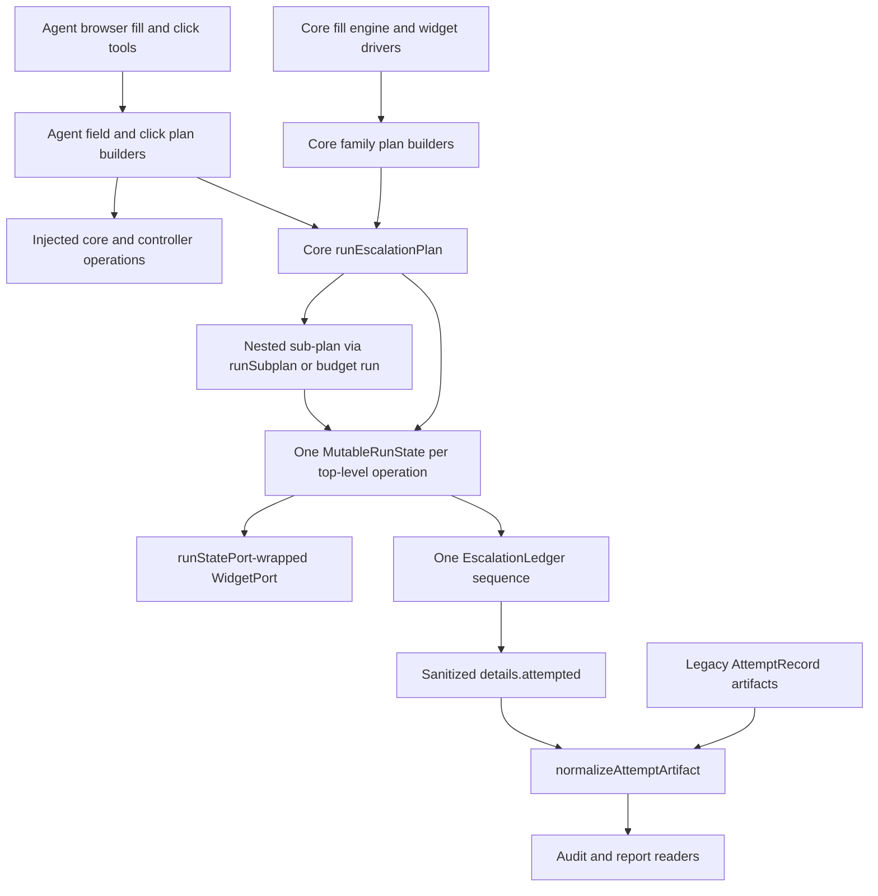

For every rung, the runner first evaluates eligibility and verifies that the declared cap fits the
remaining allowance. A rung that is ineligible or cannot fit is recorded as `skipped` without
spending work. An entered rung runs through a `WidgetPort` wrapped by `runStatePort`, the single port
wrapper: it counts actual click, fill, clear, type, key, and container-scroll mutations, counts reads,
and heals a stale ref through the run's own `reacquire` policy under the shared `maxReacquisitions`
cap. Non-port agent actions use the same state's explicit `charge()` hook. The wrapper is idempotent
for a given run — it tags itself with a non-enumerable symbol — so a rung body that hands its own
`context.port` to a nested plan is charged exactly once however deep the nesting goes.

Exactly one `MutableRunState` exists per top-level operation. `createRunState(budget, now)` is its
only constructor, and `runEscalationPlan(plan, parentState?)` resolves the run as the parent state,
else the run carried on `PlanBudget.run`, else a root it creates itself. `deadlineMs`, `maxActions`,
and `maxReacquisitions` are fixed by whoever created the state and are read-only thereafter, so a
nested plan can neither widen nor narrow the ceiling. The run rides on the budget — `WidgetBudget.run`,
forwarded by `asPlanBudget` into `PlanBudget.run` — because the budget already flows unchanged from
`fillField` through `WidgetDriver.drive` and `commitText` into every plan builder, so joining a run
changes no driver signature. `fillField` creates the run when its caller supplies none and adopts it
when one is present, and builds the field port from `runStatePort` before its first read, so work
outside any rung — range resolution, widget dismissal, the settled commit — charges into the same
counter that `FillSuccess.actions` reports.

Nesting therefore yields one sequence rather than several merged afterwards. Ordinals are assigned on
completion, so a nested rung's verdict precedes its enclosing rung's, and a rung's own
`chargedActions` excludes whatever nested verdicts already claimed: summing the ledger partitions the
run total exactly, and `remainingActions` is non-increasing down the sequence. Nothing splices or
renumbers driver-local ledgers. Cleanup runs in a `finally` only for an entered rung.

Drivers own no ledger. A `WidgetSuccess` discloses how it resolved through an optional
`evidence: VerdictEvidence` of scalars only, which the runner records on the rung that ran it, and
`SERIALIZED_EVIDENCE_KEYS` in `escalation.ts` allowlists what may reach the wire — `substituted`,
`substitution_position`, `tie_break`, `scroll_steps`, `scroll_stop`, `revealed_driver`, and
`reacquisitions` — so working values such as a committed string, an offered list, or a container path
are dropped rather than serialized. The engine-owned open probe splits the same way: `probeOpen` owns
the open, the container wait, and the mandatory drive-or-dismiss, while driving what it revealed is an
injected callback that the engine implements as an ordinary family sub-plan on the shared run, so each
revealed driver arrives as its own `driver:<kind>` verdict in that single sequence.

The resulting `EscalationLedger` is a projection of what the plan did, including what it declined
to do. A succeeded verdict carries entry evidence, elapsed time, charged and remaining actions,
and produced evidence; a failed verdict additionally carries the stable error code; a skipped
verdict carries only its structural `unmet` reason. `escalationLedgerOf(state, descriptor)` projects
the whole run, and `toWireLedger` serializes it — bounded by `MAX_SERIALIZED_VERDICTS` — into
snake-case `details.attempted`: `error_code` is present only for `failed`, never as `null` on success
or skip, and no production path narrows a verdict to the older nullable record shape on the way out.
`normalizeAttemptArtifact` accepts both that verdict shape and legacy nullable `AttemptRecord`
arrays on read, and the report builder normalizes audit entries without rewriting any existing run
directory. The one-rung secret plan remains blind: it performs no verification read and emits no
secret-derived evidence.

#### Page-delta observation

After a successful browser action the agent used to receive a fresh fifty-element observation and
nothing else, left to work out by re-reading the list what the action had done. A bounded `delta`
block now rides beside that observation and says it directly: the URL changed, a dialog named
`Cookie consent` opened, twelve elements appeared and three vanished, focus moved from one control to
another.

**One differ API, two identity policies.** `diffKeyed(before, after, { key, changed?, sampleCap? })`
in `packages/core/src/interaction/differ.ts` is the whole comparison surface, and it compares
multisets: three controls sharing a key against five sharing it is two appearances, not zero, which is
the most common way a set-based page diff under-reports. What it deliberately does not decide is
identity. `locateEditee` keys by `entry.ref` — it holds a live ref for the control it just typed into
and every consumer of the answer drives by ref, so ref identity is exactly right there and its
behavior is unchanged. `diffFingerprints` keys by a semantic identity instead, because refs are minted
by `(role, name, ordinal)` and same-named controls that reorder between observations trade ref
identities. The unique-key case falls out as the count-1 case with no special branch. The API is
generalized; the identity rule is not.

**The fingerprint is uncapped and private.** `packages/core/src/interaction/page-delta.ts` defines
`ObservationFingerprint`: the document epoch, the semantic multiset of visible interactables, the
visible container identities, the focused element's identity, url and title, and the `truncated` and
`degraded` flags. Identity is `(role, name, group, scope)` joined by a `\u001F` unit separator with
each part clamped — deliberately not the ref, and deliberately carrying no position or ordinal, since
an element that moved is the same element. That, with multiset counts in place of ordinals, is what
stops reordered same-named controls from trading identities and stops the fifty-element model cap from
turning a stationary element into a vanishing. The separator is written as an escape in source rather
than as a raw byte, because a literal separator byte makes a file read as binary to `grep` and `file`.
The fingerprint is never model-visible, never persisted, and never logged.

**It never over-claims.** `diffFingerprints` is pure and total: a bound it cannot see past becomes a
completeness marker rather than a manufactured number. `complete: false` is emitted with, and only
with, an `incomplete` list drawn from a closed three-value set carrying no page text —
`document-replaced` (the epochs differ, so the two frames' controls are not comparable and element
counts and focus are omitted), `fingerprint-truncated`, and `scan-degraded`. Which bounds applied is
decided in one function, so the rule "no definite count past a bound that invalidates it" is enforced
at a single site instead of drifting field by field, and the marker's absence is what makes the block
definite. One standing bound is documented on the type rather than repeated per call: a container is
nameable only when it holds at least one scanned candidate, so a delta lists the dialogs it observed
opening or closing and never asserts that none is open. Every cap is a named constant —
`FINGERPRINT_MAX_ENTRIES`, `DELTA_DIALOG_CAP`, `DELTA_SAMPLE_CAP`, `IDENTITY_PART_MAX_CHARS`, and
`DELTA_MAX_BYTES`, the last enforced where the block is built by trimming element samples first, then
dialog names, and never the counts or the completeness reasons.

**It costs no page read.** `buildAgentPageSnapshot` in `packages/core/src/discovery/observe.ts` orders
the scan once, derives the fingerprint from the whole visible list, and only then applies
`.slice(0, maxInteractables)`; the fingerprint rides back on `AgentPageSnapshot`. In the controller,
`stampDocument()` became a read-or-mint on the single `evaluate` it already made, so the marker is a
stable per-document **epoch** rather than a fresh value per observation — `isSameDocument()`'s
present-and-equal semantics and the evaluate count per `observe()` are both unchanged.
`lastScanFingerprint` updates on every scan because it is the _after_ side of any delta;
`deltaBaseline` updates only when `trackDigest !== false`, reusing the flag that already means "the
model saw this frame" so internal resolution reads — field resolution, click re-acquisition, identity
healing — cannot steal the baseline and make a delta report a frame the model was never shown.
`beginToolCall()`, already the middleware's per-call boundary for the obstruction clearance, pins the
call baseline, which is what makes one delta per top-level tool call a property of the call rather
than of whichever action happened to run last. `deltaSinceBaseline()` and `takeActionMetadata()` both
take zero page reads.

**Additive at the tool seam, by decision.** `modelDelta()` in `browser-common.ts` is an explicit
allow-list projection rather than a pass-through — the fingerprint behind the block holds an identity
key for every control on the page — and a boundary test asserts that no fingerprint field and no
identity map reaches a payload. `observeAfterAction` returns `{ observation, delta }` and keeps its
best-effort contract: a failed read degrades to neither, because a diagnostic may never turn an action
that already succeeded into a tool error. `browser_click`, `browser_navigate`,
`browser_fill_element`, and `browser_fill_form` emit `delta` **alongside** the existing `observation`,
and `browser_observe` is deliberately unchanged. Where there is no baseline to diff against — the
ordinary state of a run's first navigation — the block is omitted entirely and
`details.delta_omitted: 'no-baseline'` records why, so an absent block never reads as "nothing
changed". Removing the embedded observation is a later, measured decision, and this wave claims no
token saving. The fill tools additionally gained the URL provenance and tab-following
`browser_click` already had: `browserWidgetPort(controller, now, sink?)` accepts a plain
`ActionMetadataSink` — a collector with no retry, budget, or ordering semantics of its own — and
`drainFillMetadata` merges it with the controller's read-free drain, so a popup, dialog, or landing URL
a fill caused is attributed to that fill rather than leaking onto whatever tool runs next.

**The evidence for the deferred decision.** `summarizeDeltaCost(entries)` in
`packages/core/src/audit/delta-cost.ts` reads `tool-calls.jsonl` `end`-phase entries in `seq` order
and reports total and maximum delta bytes, the observation bytes shipped beside them, and the rate at
which the model's next call was `browser_observe` anyway. It is a reader only: it adds no field to the
strict `ToolAuditEntry` schema, changes no behavior, and claims nothing. A block a tenth the size of
the observation is not a saving until the follow-up rate shows the model does not simply re-observe.

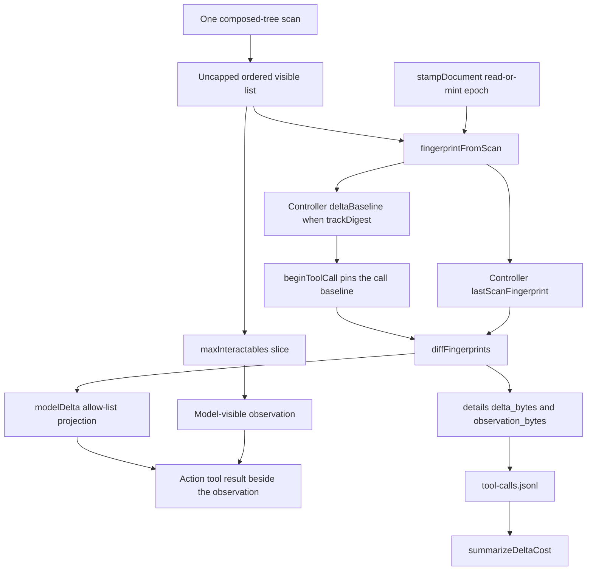

### `packages/agent`

`@yantra/agent` owns live model-driven execution. `runAgenticTask()` creates the auditable run,
applies deterministic pre-flight gates, builds a per-run service graph, registers only the tools
allowed by the selected command profile, opens one fresh provider session, consumes normalized
events, enforces budgets and retry limits, requires a validated publication, and tears down the
browser and session on every terminal path.

Provider-neutral code depends only on the small `AgentProvider`/`AgentSession` seam. Imports from
`@earendil-works/pi-coding-agent` are confined to `packages/agent/src/adapters/pi/`, which maps Pi
sessions, events, and tool definitions to Yantra-owned types. Pi built-in filesystem, shell, and
editing tools are disabled; each session receives exactly its command-profile Yantra tool
allowlist.

All registered tools pass through one provider-neutral middleware pipeline. Ordinary results take
the text-only path. The screenshot tool additionally takes the single image path, where middleware
re-opens and verifies the private artifact before the Pi adapter can construct an image block:

```mermaid
flowchart LR
  Call[Provider tool call] --> Validate[Closed-schema validation]
  Validate --> Budget[Abort, budget, and timeout]
  Budget --> Policy[Host, ethics, scope, and action-phase policy]
  Policy --> Consent[Confirmation when required]
  Consent --> Domain[Core domain operation]
  Domain --> Sanitize[Sanitize and bound text]
  Domain --> ImageGate[Verify authorized PNG artifact]
  Sanitize --> Result[Stable text or text-plus-image result]
  ImageGate --> Result
  Result --> Provider[Pi result blocks]
  Provider --> AuditProjection[Remove image bytes from stable projection]
  AuditProjection --> Audit[Events, tool audit, usage, and artifact metadata]
```

### Vision-assist boundary

Vision availability is an immutable run decision made before tool-catalog construction. The
`browser_screenshot` tool exists only when all five inputs agree: the effective, approved
`context.screenshots` preference is exactly `true`; the command profile has browser tools; the Pi
model registry declares image input for the selected provider/model; `--no-screenshots` is absent;
and the context is not zero-LLM. A missing or malformed preference, registry miss, text-only model,
non-browser profile, suppression flag, scheduled/daemon execution, or nested workflow execution
therefore removes the capability from both the provider-visible catalog and its catalog hash rather
than returning a runtime denial. The CLI prints the raw-pixel/provider/local-retention warning before
writing an enabled grant; Ollama changes the destination wording but does not remove the warning.

Responsibilities stay on the existing dependency seams:

- `packages/core` owns the browser-facing primitives: viewport or `eNN`-scoped CDP PNG capture,
  top-level document epochs, the `SensitiveScreenLatch`, and the temporary set-of-marks overlay.
  The overlay contains only Yantra refs, is epoch-guarded around capture, and is removed and checked
  in mandatory cleanup.
- `packages/agent` owns the provider-neutral five-condition availability value, conditional tool
  registration, dedicated capture accounting, private artifact creation, image-result validation,
  and stable audit projection. Only the Pi adapter translates the validated image into the provider
  SDK's image block.
- `apps/cli` resolves the effective grant and one-run suppression, emits consent/revocation
  messaging, and renders capture metadata from `tool-calls.jsonl` as the images the model saw.

The controller's latch is shared by the fill and screenshot tools through the run service graph. A
host-bound secret fill sets it immediately before the resolved value can be dispatched to the page.
Capture then fails closed until a readable top-level document epoch differs from the latched epoch;
clicks, DOM updates, dialogs, timers, and same-document SPA routing do not clear it. Browser teardown
is the only other clearing path.

### `apps/cli`

`@yantra/cli` is the executable composition root. `src/bin.ts` delegates to the Commander program
in `src/index.ts`, which registers the public command surface. Commands parse and validate input,
merge flags/environment/profile defaults, choose deterministic or agentic execution before
constructing a provider, build runtime dependencies, render terminal or machine output, record
best-effort history, and map outcomes to exit codes. The CLI does not implement a second agent
reasoning loop.

The installation-management commands compose the core boundaries rather than maintaining their own
configuration dialect. `yantra browser install` is the explicit managed-acquisition surface. Its
human progress and notices use stderr; JSON mode keeps stdout to one versioned `browser_install`
envelope. Missing acceptance is exit 1, decline or cancellation uses the user-handoff exit 4, and
classified host, network, helper, compatibility, publication, or contention failures use
environment exit 3. The command never changes browser selection: when a system selection remains in
effect, the successful result points to the separate `yantra browser use managed` action.

`yantra config` exposes path provenance, validated reads and writes, editor
validation, and guarded data-root relocation; its document-based YAML mutations preserve comments
and replace files atomically with owner-only permissions. Relocation is explicitly user-invoked,
checks the daemon/run lock, prefers rename, and uses copy-then-delete for a cross-volume move or an
explicit merge into a non-empty target. It is also a first-class caller of the managed-browser use
contract: it refuses before touching the filesystem while a managed browser run is active, because
a live managed `chrome.exe` holds its own binary open on Windows and the move would otherwise fail
halfway. The managed tree is handled explicitly rather than as ordinary bytes — decided up front so
`--dry-run` can report it, it moves with the data directory on the same volume and is dropped for
reinstallation across volumes rather than copying hundreds of megabytes of re-downloadable
binaries. `yantra secret` writes credentials through the keychain
boundary without accepting values in argv, while `yantra model` manages the registry in
`config.yaml` and writes the selected provider/model to `profile.yaml`. Interactive `yantra init`
produces both schema-valid files through the same models, and non-interactive or JSON initialization
accepts defaults without prompting.

`yantra open` resolves a named run, or the newest filesystem run, through `LocalRunStore`; it opens
the requested brief, report, audit, or run directory and can instead print the path or emit JSON.
Run-producing commands share `--open`, while the normal terminal artifact footer points back to
`yantra open <run-id>` for deferred inspection.

The principal execution surfaces are:

| Surface                         | Owning runtime                         | Behavior                                                                                                             |
| ------------------------------- | -------------------------------------- | -------------------------------------------------------------------------------------------------------------------- |
| `ask --no-llm`                  | Core `AskPipeline`                     | Single-hop search, concurrent source processing, deterministic synthesis, and Brief artifacts.                       |
| `research --no-llm`             | Core `ResearchLoop`                    | Bounded multi-hop search, coverage tracking, source diversification, deterministic synthesis, and state snapshots.   |
| Agentic `ask`, `research`, `do` | Agent `runAgenticTask()`               | One fresh model session with capability-filtered, policy-wrapped Yantra tools and validated publication.             |
| `run`, `resume`                 | Core `RunOrchestrator`                 | Validated, finite workflow-to-plan replay; optional output synthesis cannot steer execution.                         |
| `daemon`                        | Core `SchedulerDaemon` plus CLI wiring | Polls local schedules and invokes the same workflow orchestrator with a fail-closed unattended confirmation gateway. |

### Test-only workspaces

`@yantra/test-helpers` supplies shared fixtures and no-LLM/provider tag plumbing. `e2e/` depends on
the production workspaces to exercise CLI flows, deterministic research, scheduling, real-Chrome
browser actions, agent orchestration, workflow promotion/replay, golden Briefs, and compatibility
boundaries. Vitest remains the common test runner across every workspace. Managed-browser
exclusion is the one contract that cannot be demonstrated with mocked asynchronous functions,
because the guarantee is about two operating-system processes racing for the same files, so a
standalone fixture script takes a real claim in a real child process and holds it while the parent
asserts what the other side is refused.

#### Interaction quality gate

The browser interaction layer has three complementary, `@no-llm` contract tiers. The protocol
gauntlet in `packages/core/tests/interaction/widget-regressions.spec.ts` runs 13 generic widget
fixtures through the production `fillField` seam using a JSDOM-backed `WidgetPort`. Its
`PROTOCOL_GAUNTLET` registry is the source for independently named cases, expected semantic
outcomes, and exact operation budgets. The registry permits either a commit or an engineered
refusal whose cataloged hint is proven by a follow-up fill that commits; an unsupported behavior
cannot be recorded as an acceptable terminal outcome.

`countingPort()` classifies every `WidgetPort` method at compile time: clicks, fills, clears,
typing, key presses, and container scrolls are mutations; observations and evaluations are reads;
the clock is neutral. Counting a scroll as a read would let a driver reveal an unbounded number of
options for free, so the classification is exhaustive over the port by type. Each fixture pins mutations and reads separately and reports a per-method breakdown, so
an extra recovery action or diagnostic page read is visible even when the final value is correct.
The suite also keeps the registry and fixture directory in census, requires unique generic
pattern names, confines any site provenance to a leading fixture comment, and decodes fixture
text with a fatal UTF-8 decoder.

The real-browser tier in `e2e/widget-gauntlet.spec.ts` serves its 4 fixtures over loopback, launches
system Chrome, wraps a real `AgentBrowserController` with mutation/read counters, and invokes the
same wrapped `browser_fill_element` tool and middleware used by agent runs. Its re-mounting search
form case pins one top-level model tool call, controller operation counts, the parsed
model-visible result, fresh-ref validity, and stale-ref rejection. Its open-shadow case fills a
control inside an open shadow root by accessible name, confirms from the page that the commit landed
inside the shadow tree, and asserts that the sibling control in a closed root is simply absent from
observation — not a third expected-outcome arm, because a closed root is not a gauntlet pass. The
same case asserts on key names that `composedScope`, `elementIndex`, and `rootNodeDepth` never
appear in any model-visible payload. Registry-to-directory census prevents an agent-tier fixture
from silently falling outside the suite. This tier deliberately does not reconstruct
`tool-calls.jsonl`; run-recorder tests own that durable projection.

Across both tiers the gallery is 17 fixtures, and that total is asserted as a literal number so
growing it is a deliberate edit rather than a side effect. It is the gate FEAT-034 waits on.

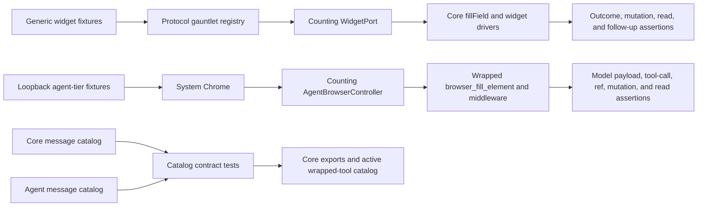

Model-visible interaction copy is split along the production dependency boundary. Core owns the
shared `MessageTemplate` contract and the fill, actionability, and fill-success registries in
`packages/core/src/interaction/messages.ts`; agent owns tool and middleware entries in
`packages/agent/src/runtime/messages.ts` while importing only that core contract. Renderers fail
on a missing template or required detail instead of falling back to generic advice. Contract
tests require unique `(surface, code, cause)` keys, globally distinct rendered text, stable core
error codes, UTF-8 round trips, and resolution of imperative hints to either a public core
function or the active wrapped-tool catalog. The agent test additionally scans interaction tool,
middleware, and budget sources so a newly emitted literal error code cannot bypass its catalog.
The recovery gate also asserts that production contains exactly one escalation runner and one
declared builder for every interaction family, with none of the former nested recovery-loop
implementations restored. Runner tests pin rung ordering, cap admission, shared sub-plan accounting,
cleanup, fast failure on an injected clock, and the discriminated wire keys. The old nullable
success-code shape remains only a reader-compatibility input and is normalized without rewriting
the source artifact.

## Data Flow

### Browser selection and startup

Every browser start follows the same sequence, whether it serves an agent run, deterministic
replay, a browser-backed fetch, or a recording. Resolution and evidence lookup are read-only, the
managed claim is taken before anything else touches the tree, compatibility is settled before any
user page can exist, and each step's acquisitions are undone if a later one fails.

```mermaid
sequenceDiagram
  participant Caller as Runtime factory or recorder
  participant Provider as Browser provider
  participant Resolver
  participant State as Managed state and coordinator
  participant Compat as Compatibility service
  participant Cache as Evidence cache
  participant Launch as Shared launch path
  participant Supervisor as Process supervisor

  Caller->>Provider: launch with an optional selection
  Provider->>Resolver: resolve selection or config or auto
  Resolver->>State: read ready pointer
  State-->>Resolver: ready record, absent, or invalid
  Resolver-->>Provider: resolved installation with provenance
  Provider->>State: reserve managed use when managed
  Provider->>Compat: verify for this capability profile
  Compat->>Cache: read evidence for this exact identity
  alt no valid evidence
    Compat->>Launch: isolated headless synthetic session
    Launch-->>Compat: capability results
    Compat->>Cache: record the result; only a pass is evidence
  end
  Compat-->>Provider: passed or typed failure
  Provider->>Provider: create profile, then re-stat the executable
  Provider->>Launch: launch under the held ownership
  Launch->>Supervisor: adopt the child process
  Launch-->>Provider: owned browser process
  Provider-->>Caller: live session
  Note over Provider,Supervisor: On close or crash: graceful close,<br/>bounded escalation, verified tree exit,<br/>then release the reservation
```

### Managed Stable installation

The explicit command and accepted first-run offer converge only after consent. Stable acquisition is
the sole browser-install network path; ordinary resolution, startup, diagnostics, and compatibility
cache reads never enter it.

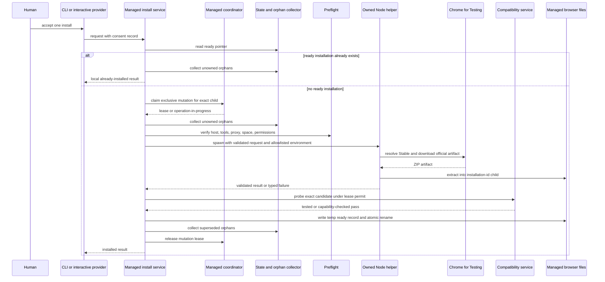

Cancellation or failure before the atomic rename follows the same state transition as a killed
process: the pointer stays absent or retains its prior target, the new child is an orphan, and the
next explicit install or update can collect it. No persisted phase machine is consulted or resumed.
After an accepted first-run offer succeeds, the provider resolves again and then enters the ordinary
browser-startup flow above.

### Deterministic web research

The deterministic `ask` path is selected before any provider session is created. Search results
are fetched and extracted through a shared per-source path guarded by ethics checks. The
synthesizer receives extracted documents and structured failures, validates citations, and writes
the canonical Brief in JSON, Markdown, and inert HTML. `research` repeats the same core stages
within explicit hop, source, time, and LLM-call budgets while persisting `research-state.json`.

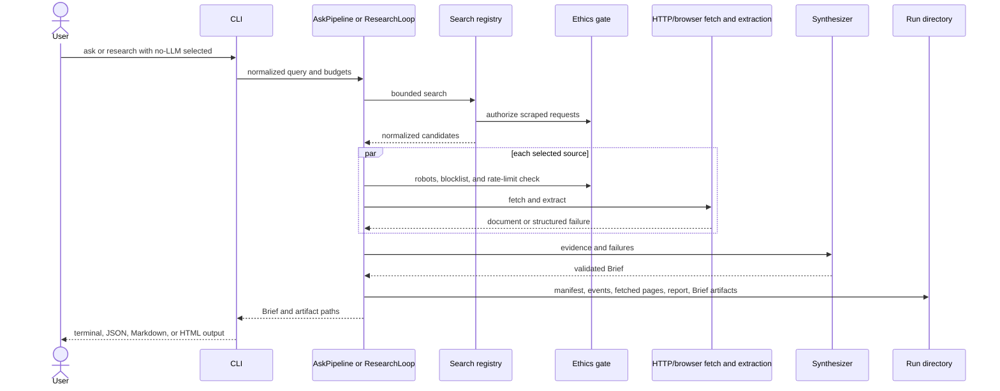

### Agentic task

Agentic `ask`, `research`, and `do` share the same orchestrator but receive different tool
allowlists. User-authored values are parsed and redacted before provider or browser state exists.
The runtime creates the run directory before provider validation, constructs policy and evidence
ledgers, opens a fresh Pi-backed session, and records only normalized audit projections alongside
the sensitive run-local provider session. Browser startup is lazy for browser-capable runs. A
successful run ends with `result_publish` producing a protocol-valid Brief or templated report;
plain assistant text alone is not the success contract.

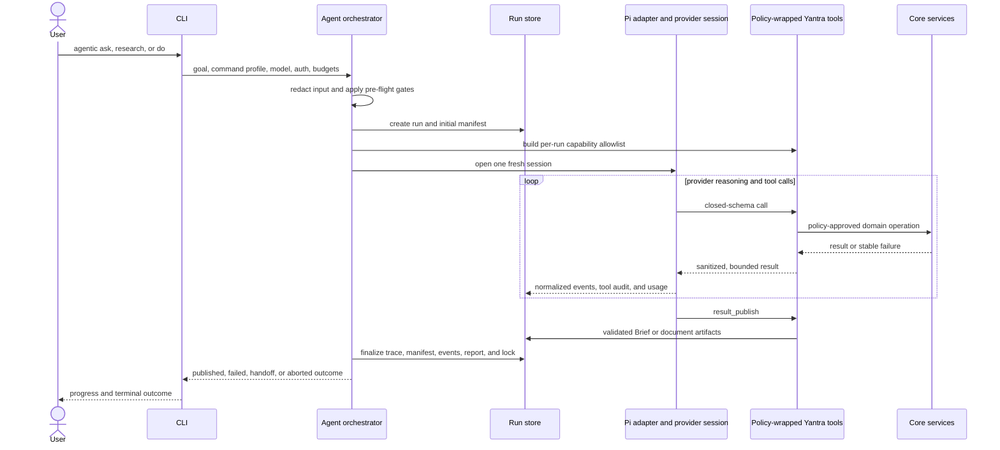

### Vision-assisted screenshot capture

Screenshots are agent-requested fallback evidence, not an automatic observation path. A request can
capture the current viewport or the rectangle for an existing opaque `eNN` ref. The browser
controller clips capture dimensions to 1600 by 1200 pixels, overlays the current Yantra refs, uses
CDP `Page.captureScreenshot` in PNG mode, verifies the document epoch, and removes the overlay. The
tool checks the PNG signature and encoded size, hashes the exact bytes, and atomically writes
`screenshots/<sequence>-<sha256-prefix>.png` beneath the run directory with restrictive permissions.

The middleware then independently verifies that the artifact stays beneath the run directory and
that its bytes, SHA-256 digest, MIME type, base64 payload, and recorded dimensions agree. Dedicated
budgets allow at most three reserved captures per run, at most 1,600 x 1,200 pixels and 5 MiB per
capture; image pixels and bytes do not consume the ordinary text-result byte counters. Only after
these checks does the image cross the Pi provider seam.

```mermaid
sequenceDiagram
  participant Model as Model provider
  participant Pi as Pi adapter and session
  participant Tool as browser_screenshot
  participant Guard as Latch and capture budget
  participant Core as Browser controller
  participant Page as Web page and Chrome CDP
  participant Run as Run directory
  participant Middleware as Tool middleware
  participant Recorder as Run recorder

  Model->>Pi: request viewport or eNN capture
  Pi->>Tool: invoke wrapped tool
  Tool->>Guard: require unlatched epoch and reserve capture
  Tool->>Core: capturePng(optional ref)
  Core->>Page: inject Yantra ref marks
  Core->>Page: capture bounded PNG through CDP
  Core->>Page: remove and verify overlay
  Core-->>Tool: PNG bytes and dimensions
  Tool->>Run: atomically persist private PNG
  Tool->>Middleware: metadata plus image payload
  Middleware->>Run: re-read and verify path, hash, bytes, and limits
  Middleware-->>Pi: sanitized metadata text plus PNG image block
  Pi-->>Model: provider tool result
  Pi->>Recorder: normalized tool-finished event
  Recorder->>Run: metadata-only tool-calls.jsonl entry
  Note over Pi,Run: Raw provider session and PNG contain pixels; stable audit/report logs do not
```

### Configuration, model, and credential flow

Path resolution happens before most command wiring, while full configuration validation happens at
the command or service boundary. Data/cache accessors perform one memoized synchronous read so
legacy synchronous consumers receive the same resolved roots; ordinary configuration consumers use
the typed asynchronous loader. Mutating CLI commands validate before replacement and clear the path
memo when a storage key may have changed.

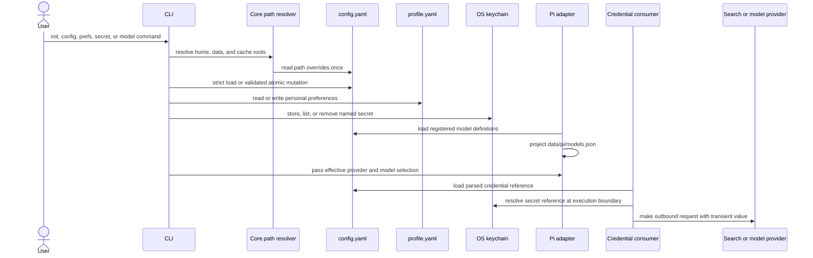

Environment references are resolved directly from the process environment rather than the
keychain. The diagram's final two messages represent the secret-reference branch; neither branch
puts resolved credential material back into `config.yaml`, `profile.yaml`, or the Pi model
projection.

### Saved workflow replay and scheduling

`RunOrchestrator` loads a user-owned workflow YAML, resolves parameters, translates the workflow
to a fixed protocol plan, preflights secrets and safety constraints, then creates the run and
launches Chrome. The executor resolves locators and values step by step, writes checkpoints and
events, evaluates declared outputs, and optionally synthesizes a Brief only after execution has
finished. A model may write that final document when the workflow declares `synthesis.use_llm`,
but it cannot alter steps, branches, loop bounds, or locator repair. `--no-llm` vetoes synthesis;
nested `workflow_run` and scheduled daemon executions hard-disable it.

The scheduler is a lightweight local process. It polls SQLite schedules, skips missed or
overlapping fires, and calls the same orchestrator used by interactive `run`. Its confirmation
gateway can only park and notify; it never grants a protected action automatically.

## Data Model

Yantra has no remote database and no single relational domain model. Durable state is split by
ownership: user-editable definitions and canonical execution records are files, secret material
lives in the OS keychain, and SQLite supplies local indexes and operational tables.

`YantraConfig` is the versioned, strict document model for installation state. It includes optional
absolute data/cache overrides, a unique `(provider, id)` model registry, search-provider references,
ethics and rate-limit policy, retention bounds, and the optional Pi-auth path. Its credential leaves
are the closed `ConfigRef` union (`env` or `secret`), not plaintext. `ProfileFile` remains the
separate validated model for personal preferences. Neither adds a SQLite migration; retention consumes
the config to prune expired run directories and cap `index.db.corrupt.*` backups during index
startup.

Interaction recovery adds no relational state. Its durable form is the bounded verdict array under
a sanitized tool result's `details.attempted` in `tool-calls.jsonl`; plan objects, evidence, shared
budget state, and ledgers are in-memory execution concepts. Audit/report readers accept both this
shape and legacy attempt arrays, normalizing on read only.

Page-delta observation adds no relational state either, and no new artifact. `ObservationFingerprint`
is in-memory controller state that is never persisted; the bounded `delta` block rides the existing
tool result, and its cost — `delta_bytes`, `observation_bytes`, or `delta_omitted` — rides the
existing sanitized `details` payload into `tool-calls.jsonl`, so the strict `ToolAuditEntry` schema
gains no field. `summarizeDeltaCost` reads that projection back and writes nothing.

Vision assist likewise adds no table or migration. `context.screenshots` is one boolean in the
existing `profile.yaml` context block and keyed JSON `preferences` namespace; the effective view is
granted only for an approved literal `true`. `VisionAvailability`, its dedicated budget counters,
and `SensitiveScreenLatch` are run-local memory. Accepted PNGs are filesystem artifacts under
`runs/<run-id>/screenshots/`; the strict `ToolAuditEntry` schema has an optional, backward-compatible
`captures` array containing only relative path, SHA-256, MIME type, dimensions, and byte length.

Browser management adds no table and no migration either; its model is filesystem state under the
managed root plus one cache. `<data>/browsers/ready.json` is the entire selection model for
managed builds — a strict, versioned record naming exactly one `installation-<id>` child by
relative path, with a recorded relative executable and a provenance timestamp that is deliberately
not compatibility evidence. `operation.json` beside it is the exclusive mutation claim, recording
an owner's process creation identity and the one candidate path that owner may write, and it is
deliberately not a phase record; `coordination/` holds the metadata mutex and the shared use
reservations, and sits outside every child cache so deleting one child can never encompass another
or the coordination state itself. Every other `installation-*` child is an orphan by construction,
which is why directory enumeration can never make a second build selectable. Compatibility
evidence lives separately under `<cache>/browser-compatibility` as one strict JSON document per
executable identity and probe profile, is regenerated by a local probe when absent, and is never
required for correctness — losing it costs one probe, never a download. Resolved installations,
reservations, leases, and probe permits are in-memory per-process values that persist nothing
beyond those files.

Acquisition adds no database state and no recovery document. `DownloadConsentRecord`, bounded
progress, helper requests/messages, and candidate-probe permits exist only for one operation. The
helper writes the upstream Chrome-for-Testing cache layout inside its exact
`installation-<id>` child. Until atomic publication makes `ready.json` name that child, it has the
same durable meaning as every other orphan; transient progress phases are never written to
`operation.json` or inferred after a restart.

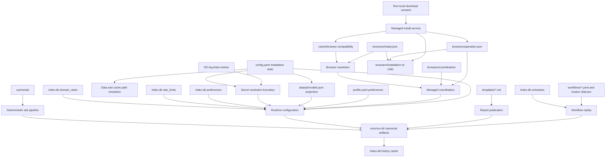

| Store                          | Verified contents and role                                                                                                                                                                                                                                                                                                                                                     |
| ------------------------------ | ------------------------------------------------------------------------------------------------------------------------------------------------------------------------------------------------------------------------------------------------------------------------------------------------------------------------------------------------------------------------------ |
| Home `~/.yantra/`              | Fixed installation root (or `YANTRA_HOME`): strict `config.yaml`, human-editable `profile.yaml`, user `blocklist.yaml`, and sanitizer host overrides. Configuration holds references, never resolved secret values.                                                                                                                                                            |
| Data `workflows/`              | Canonical saved workflow YAML plus optional locator sidecars; preserved as user-owned input.                                                                                                                                                                                                                                                                                   |
| Data `templates/`              | Saved Markdown report templates.                                                                                                                                                                                                                                                                                                                                               |
| Data `runs/<run-id>/`          | Canonical observability record: manifest, events, audit/report files, outputs, checkpoints, private `screenshots/*.png`, fetched sources, Brief/document artifacts, traces, and agent session metadata as applicable. `tool-calls.jsonl` references screenshots by metadata only; the raw provider session can contain image data.                                             |
| Data `index.db`                | SQLite schema version 3: `history`, `preferences`, `rate_limits`, `schedules`, `domain_ranks`, and `meta`. History rows reference run IDs logically and can be rebuilt from run directories; the schema declares no foreign keys between these tables.                                                                                                                         |
| Data `pi/`                     | Pi session staging, the default pinned auth store, and deterministic `models.json` derived from `config.yaml`. The explicit `agent.pi_auth_path` opt-in changes auth only; no ambient Pi settings, skills, prompts, or model file are loaded.                                                                                                                                  |
| Data `browsers/`               | Managed browser tree: `ready.json` (the one selectable installation), `operation.json` (an exclusive owner/path claim, never a phase log), `coordination/` (mutex and shared use reservations), and one upstream cache in each `installation-<id>` child. Only the child the pointer names is selectable; every other child is an orphan collected by explicit install/update. |
| Cache `ask/`                   | TTL- and size-bounded deterministic Brief cache keyed by normalized query, search provider, and UTC day.                                                                                                                                                                                                                                                                       |
| Cache `browser-compatibility/` | One JSON evidence document per executable identity and probe profile, keyed by canonical path, version, stat fingerprint, host, driver version, probe revision, and capability-table hash. Regenerable by a local probe; only successful results are evidence.                                                                                                                 |
| Browser profiles               | Ephemeral profiles in the OS temporary directory by default; workflow-scoped persistent profiles under the data directory when explicitly selected. Compatibility probes use their own ephemeral profile, removed on success and failure alike.                                                                                                                                |
| OS keychain                    | Search/model credentials and workflow secret values. Artifacts persist opaque references and audit metadata, not resolved values.                                                                                                                                                                                                                                              |

The default data and cache roots are `<home>/data` and `<home>/cache`. `YANTRA_DATA_DIR` and
`YANTRA_CACHE_DIR` take precedence over `config.yaml`'s respective absolute path, and all three
platforms use the same rule. Run directories are created with restrictive permissions where the
platform supports them, and ephemeral browser profiles are cleaned up on close or crash.

## Key Design Decisions

- **Local-first execution and observability.** The CLI and optional daemon run on the user's
  machine. Run directories are the durable audit boundary, while external telemetry is absent
  from the implemented runtime.
- **One platform-independent home with narrow relocation.** `YANTRA_HOME` or `~/.yantra` locates
  configuration and the default durable state; only data and cache can resolve elsewhere, with
  environment overrides above validated config paths. Ephemeral browser profiles remain in the OS
  temporary directory. This trades platform-native XDG/AppData placement for one predictable layout
  and fixes policy files that previously read from a directory no writer used on Windows.
- **Installation state and user preference are separate authorities.** `config.yaml` answers what
  is installed or available; `profile.yaml` answers what the user prefers. CLI key ownership and
  cross-command redirects keep a setting in exactly one file, while the model registry contains no
  default marker because effective model selection already belongs to the profile precedence chain.
- **Secrets remain references and third-party config remains derived.** Config validation accepts
  only environment or keychain references in credential fields, and resolution occurs at an
  execution boundary. Pi's `models.json` is regenerated inside the adapter from Yantra's registry,
  which keeps resolved credentials off disk and confines Pi's schema to the provider seam.
- **Schema-first contracts.** Zod is the protocol source of truth, with TypeScript types,
  validators, JSON Schema, and protocol documentation derived from it. This adds generation and
  verification work but prevents hand-maintained contract drift.
- **Layered dependency direction.** Core cannot import agent, and provider SDK types cannot cross
  the agent provider seam. The adapter confinement makes provider-specific change local and keeps
  deterministic execution independent of model availability.
- **Pin the driver; prove behavior against a separate browser fixture.** Core uses exactly
  `puppeteer-core@25.10.0`, while a fixed Chrome for Testing executable is provisioned only for the
  cross-platform migration suites. This makes driver API drift and actual Chromium behavior visible
  without turning test provisioning into application installation. Acceptance covers real input,
  popup, recorder, frame, screenshot, and replay behavior rather than types or launch-option
  snapshots alone.
- **Declared capabilities, probed locally, instead of a minimum browser version.** A version floor
  is a guess that is wrong in both directions: it rejects a working build and admits a broken one.
  Support is therefore a table of the primitives Yantra actually uses — each row carrying why it is
  required and which caller requires it — proved against the executable in front of us on the host
  in front of us. The tested pairing is recorded as a baseline, so a build newer than it reports
  `capability-checked` and reads as normal operation rather than a standing warning. The cost is a
  synthetic browser launch the first time an executable is seen; the cache key includes the
  capability-table hash so a table edit invalidates old evidence by construction, and a caller can
  never trade the gate away because there is no bypass flag.
- **One probe implementation with one session contract.** The probe always uses its own isolated
  headless synthetic session and its own ephemeral profile, and always closes both on success and
  on failure — it is never allowed to borrow the session the user is about to work in. Two
  independent implementations of "is this ready" have already cost this codebase a silent
  divergence in the actionability layer, so a second probe inside the launcher or the managed path
  is forbidden rather than discouraged; the three callers that need one are entry points into the
  same body.
- **A dead browser is one that has verifiably exited.** Signals, Puppeteer disconnects, and
  `child.killed` are requests and transport events, not proofs, and treating any of them as an exit
  would let an update delete a tree a live Chrome still holds open. Supervision therefore escalates
  on a bounded schedule and releases a managed reservation only after the child's `exit` event, and
  liveness elsewhere is judged by process creation identity rather than age, so PID reuse and
  "cannot tell" both fail in the direction of not reclaiming.
- **Browser acquisition needs a human-minted, one-operation capability.** The installer has no
  consent default, stored approval, or model tool. Explicit `--yes` and terminal prompts construct
  the same short-lived record; unattended callers structurally omit the offer gateway. This costs a
  separate gateway through runtime composition, but makes absence of a human authorization
  mechanically equivalent to absence of download capability.
- **Put an unabortable upstream installer behind an owned process.** `@puppeteer/browsers` does not
  accept an abort signal and controls extraction itself, so Yantra runs it in a compiled Node helper
  with validated IPC and a narrow environment. The parent can bound metadata and transfer stalls,
  terminate enumerable descendants, and wait for exit without making the CLI event loop or managed
  pointer part of an uninterruptible operation. The tradeoff is a second process protocol and a
  special pending-cancellation window around synchronous Windows finalization.
- **One pointer instead of a transaction log.** The managed tree keeps disjoint children and one
  atomically published pointer, which makes every interrupted state the same state: a child the
  pointer does not name is an orphan. That removes the phase machine, the recovery routine, and the
  user-visible "your last install or update did not finish" state entirely, at the cost of leaving reclaimable
  bytes on disk until an explicit command collects them.
- **Scope browser identity to the public object that owns it.** Agent popup policy follows an active
  Puppeteer Page; recorder discovery follows browser Targets but page instrumentation follows the
  exact child CDP session; locator frame identity follows a live Frame within one injected host.
  Page generations, session/target correlation, and host-local frame tokens cost explicit lifecycle
  bookkeeping, but prevent callbacks, commands, or locators from silently crossing page/session
  boundaries after adoption, navigation, detach, or teardown.
- **No website-specific automation logic, enforced rather than trusted.** There are millions of
  websites; a browser tool that works only because someone hand-tuned it for the top ten has
  failed at its job. No branch, heuristic, selector table, wait tuning, or driver hint may key off
  a particular site, brand, or host — everything works from generic structural signals: ARIA
  roles, accessible names, widget shape, observed DOM state. An ESLint `no-restricted-syntax` rule
  over `packages/*/src` and `apps/*/src` rejects site names appearing in any value the code can
  evaluate, with a fixture in `packages/core/src/_lint-fixtures/` and assertions in
  `packages/core/tests/boundary-rules.spec.ts`. Because the rule matches AST nodes, a site named
  in an explanatory _comment_ stays legal, and that distinction is deliberate: naming the site
  that demonstrated a general defect is useful evidence, while branching on one is a bug whose
  correct fix is always a more general pattern.
- **One traversal mints observation, and open shadow roots are the reachability boundary.** Records
  and the element handles they describe come from the same composed-tree pass and are related by
  `elementIndex`, so their correspondence is structural rather than conventional; a second query
  paired with an index minted elsewhere is rejected as a source rule, because that drift binds refs
  to the wrong elements without failing loudly. Reach stops at the platform's own line: an open
  shadow root is walked, a closed one returns `null` and its controls are simply unreachable. The
  alternative — a piercing library or DOM tagging — would mutate or work around the page to reach
  controls the page chose to encapsulate, and observation must not mutate page state.
- **Interaction behavior is contract-gated at both product seams.** Fast protocol fixtures
  protect widget-driver semantics and action/read cost, while the real-browser fixture protects
  controller refs, wrapped-tool behavior, and the model-visible payload. The message catalogs
  make actionable advice part of the same contract: a hint that names a move must resolve to an
  exported engine function or active tool. Splitting the catalogs between core and agent retains
  the downward package dependency instead of making core depend on the agent tool inventory.
- **Recovery policy is declarative and accounting has one owner.** Interaction families express
  escalation as ordered rungs with structural entry evidence and declared caps; the shared runner
  decides admission, records skips, and charges real mutations. One run state per top-level
  operation, carried on the budget and joined by every nested plan, is what makes the ceiling and the
  verdict sequence single rather than per-plan; drivers and the open probe report evidence and let
  the runner do the accounting. This makes a fallback a plan-data change and makes budget use
  attributable by axis, at the cost of requiring every rung to state its evidence and worst-case work
  before it can execute, and of an allowlist deciding which evidence keys may be serialized. Field
  and click plans stay in agent and inject their operations into the core runner, preserving the
  core-to-agent prohibition.
- **A page delta must be true, free, and modest about it.** Telling the agent what changed is only
  useful if it is not routinely wrong, so the delta is computed over an uncapped semantic fingerprint
  — `(role, name, group, scope)` as a multiset — rather than over the refs and the fifty-element list
  the model sees, both of which report changes that never happened when same-named controls reorder
  or fall past the cap. The differ's API is generalized and its identity rule is not: value-flow
  evidence still keys by ref. The fingerprint is derived inside the observation each action tool
  already takes, so the block costs no page read and the count is pinned by test. Where a bound —
  replaced document, truncated fingerprint, degraded scan — prevents a definite statement, the block
  carries a closed-set completeness reason instead of a manufactured number, and it says what changed
  in the action window rather than what the action caused. The block ships **beside** the existing
  observation rather than replacing it, and claims no token saving; `summarizeDeltaCost` exists to
  supply the evidence that replacement decision needs, deliberately deferred rather than assumed.
- **Screenshot access is structural, explicit, and fail-closed.** Raw pixels bypass content
  sanitization, so an approved opt-in is necessary but not sufficient: browser availability,
  provider-declared image support, the per-run suppression flag, and the zero-LLM boundary also
  decide whether the tool exists. Per-capture latch, format, artifact-integrity, and dedicated budget
  checks defend the remaining runtime path. This makes vision useful as optional fallback evidence
  without making deterministic replay, scheduled work, or the browser interaction gauntlet depend on
  it, at the cost of retaining sensitive PNGs and a capture-bearing raw provider session for audit.
- **Deterministic selection before provider construction.** No-LLM `ask`/`research`, nested
  workflow calls, and scheduled runs do not silently open model sessions. Saved replay has a fixed
  plan before any optional post-run synthesis.
- **Application-owned safety controls.** Sanitization, secrets, consent, URL policy/provenance,
  ethics, budgets, validation, and audit are enforced in code around tools and execution. This
  costs additional middleware and persistence complexity but does not rely on model compliance.
- **Filesystem authority with targeted indexing.** Human-editable workflows and profiles remain
  portable, and run directories remain inspectable. SQLite accelerates queries and persists small
  operational datasets without becoming a content warehouse.
- **One local browser, chosen by one resolver.** `puppeteer-core` drives a local Chrome executable
  over a pipe rather than a browser bundled into the package. Which executable that is comes from a
  single read-only resolution — a ready Yantra-managed installation when one exists, an externally
  installed browser otherwise — expressed as a whole selection rather than a merge of fields, and
  shared by agent runs, replay, fetch, recording, and diagnostics. Every caller then agrees about
  the browser a run is using and diagnostics cannot contradict what a launch will do, at the cost
  of routing even the recorder's deliberately different, visible session through the shared
  ownership path. An explicit selection that is missing, corrupt, or incompatible fails with
  evidence and remediation instead of silently resolving to something else.
- **Fail-closed unattended automation.** Scheduled execution reuses the interactive workflow
  engine but swaps in a park-and-notify confirmation gateway, so the daemon cannot self-authorize
  protected side effects. It also carries no browser-install offer gateway; JSON, non-TTY, daemon,
  scheduler, and nested workflow paths can report installation guidance but cannot prompt or
  download.

## Deployment and Runtime

Yantra is built, tested, and run as a Node.js application rather than deployed as a network
service. The repository pins Node 24.15.0 in `.nvmrc`, requires Node `>=24.15.0`, and declares
`pnpm@11.1.0`. All packages are ESM and compile with strict TypeScript targeting ES2022 using
NodeNext module resolution.

The pnpm workspace contains `packages/*`, `apps/*`, and `e2e`. Turborepo drives build, test,
type-check, lint, and clean tasks. The `build` task depends on dependency builds and caches
`dist/**` plus TypeScript build metadata; tests depend on builds. Protocol build first emits
generated contracts; core builds injected browser/locator assets and emits the managed-install
helper in its normal TypeScript `dist/browser/` layout; the agent and CLI compile against project
references.

At runtime there are three process shapes:

- a short-lived `yantra` CLI process that constructs dependencies for one command, optionally
  launches a run-scoped Chrome child process and provider session, writes local artifacts, then
  closes owned handles, listeners, and CDP sessions, and waits for verified process-tree exit
  before releasing any managed claim it holds;
- during an explicitly consented managed install, one short-lived Node helper child that resolves
  Stable and owns download/extraction work under an exclusive mutation lease; the CLI parent owns
  IPC validation, deadlines, cancellation, process-tree termination, verification, and ready-pointer
  publication; and
- an optional long-running scheduler daemon guarded by a single-instance lock, polling every 60
  seconds by default and spawning the same in-process workflow execution path for due schedules.

GitHub Actions runs lint, type-check, build, and tests on Ubuntu, macOS, and Windows for
`LLM_PROVIDER=anthropic` and `LLM_PROVIDER=none`, with an additional Ubuntu/Ollama cell. Separate
jobs run the static security/import-graph checks, a deterministic/browser release gate
(`build`, `test:no-llm`, static checks, and protocol verification), and an opt-in live Anthropic
smoke when the repository secret is configured. Because the two gauntlets and both catalog suites
are ordinary Vitest cases tagged `@no-llm`, Turborepo includes them in the full matrix and in the
deterministic/browser release gate. Boundary tests and the static checker enforce Pi
SDK confinement, the core-to-agent prohibition, sanitized model sends, a dependency-light JSON
render path, and exclusion of local index stores from prompt-assembly import graphs.

A required `browser-migration` job runs separately with `LLM_PROVIDER=none` on Ubuntu, macOS, and
Windows. It builds both the core locator bundle and recorder overlay, provisions Chrome for Testing
`152.0.7977.75` through `@puppeteer/browsers`, exports the exact executable and manifest to the test
process, and reports the Puppeteer/browser/platform pairing. The migration suites are made mandatory
with `YANTRA_E2E_BROWSER=1` and `YANTRA_MIGRATION_SUITE_REQUIRED=1`; Linux runs the visible recorder
coverage under Xvfb. The job exercises the migration harness, input and byte-stable replay boundary,
agent popup policy, exact recorder child sessions, live frame tokens, composed-handle cleanup, and
page-scoped screenshot cleanup. Its executable and manifest variables are test-only provisioning
inputs, reaching the runtime as an ordinary explicit `system` selection; the job installs nothing
into the managed tree.
